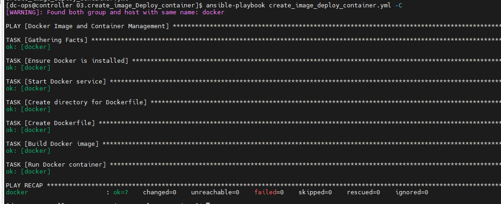
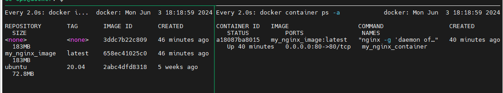

# Create a playbook to make an image and create a container from that image


## Step-by-Step Guide

### Environment: 

```bash

Ansible Server hostname : controller
Version: ansible-core version 2.14

Docker server hostname: docker
Version: Server Version: 26.1.3
```

```ini
- Install Docker on the target server (docker): Ensure Docker is installed on the docker server.

- Create a Docker image: We'll use a Dockerfile to define the image.

- Build the Docker image: Use the docker_image module to build the image.

- Run a container from the image: Use the docker_container module to run a container from the created image.
```

### Prerequisites

```css
Ensure you have passwordless SSH access set up between the Ansible server (controller) and the Docker server (docker).
Ansible and Docker are installed on their respective servers.
```

#### Step-by-Step Explanation

01. Define the playbook:

        - The playbook is named Docker Image and Container Management.

        - It runs on the docker host.

        - The become: yes directive is used to run tasks with sudo privileges.

02. Ensure Docker is installed:

        - The ansible.builtin.package module ensures the Docker package (docker-ce) is installed.

03. Start Docker service:

        - The ansible.builtin.service module ensures the Docker service is running and enabled to start on boot.

04. Create Dockerfile:

        - The ansible.builtin.copy module creates a Dockerfile on the docker server.

        - The Dockerfile uses the ubuntu:20.04 base image, installs nginx, and sets the default command to run nginx in the foreground.

05. Build Docker image:

        - The community.docker.docker_image module builds the Docker image from the Dockerfile.

        - The image is named my_nginx_image with the tag latest.

06. Run Docker container:

        - The community.docker.docker_container module runs a container named my_nginx_container from the my_nginx_image:latest image.

        - The container maps port 80 on the host to port 80 on the container.


### Playbook output:




### Container and Image status at Docker server



