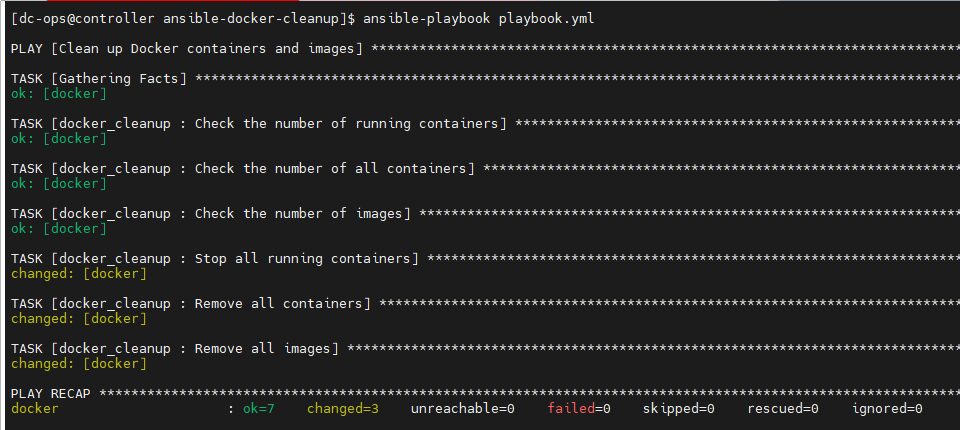

# Ansible project to delete all Docker containers and images

### Directory Structure

Here’s the directory structure for your Ansible project:

```css
ansible-docker-cleanup/
├── ansible.cfg
├── hosts
├── playbook.yml
└── roles/
    └── docker_cleanup/
        ├── tasks/
        │   └── main.yml
        ├── handlers/
        │   └── main.yml
        └── vars/
            └── main.yml

```

#### Below is the command to create directory structure
```bash
mkdir -p ansible-docker-cleanup/roles/docker_cleanup/tasks ansible-docker-cleanup/roles/docker_cleanup/handlers ansible-docker-cleanup/roles/docker_cleanup/vars
touch ansible-docker-cleanup/ansible.cfg ansible-docker-cleanup/hosts ansible-docker-cleanup/playbook.yml ansible-docker-cleanup/roles/docker_cleanup/tasks/main.yml ansible-docker-cleanup/roles/docker_cleanup/handlers/main.yml ansible-docker-cleanup/roles/docker_cleanup/vars/main.yml
```

#### 01. Create ansible.cfg

```yml
[defaults]
inventory = hosts
# remote_user = dc-ops  # replace with your remote user
host_key_checking = False
```
#### 02. Create inventory host file

```css
[docker_hosts]
docker  # replace with your Docker host IP or hostname
```
#### 03. Create the Playbook playbook.yml

```yaml
- name: Clean up Docker containers and images
  hosts: docker_hosts
  become: yes
  roles:
    - docker_cleanup
```

#### 04. playbook outcome:



