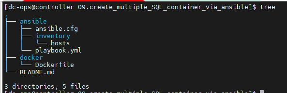
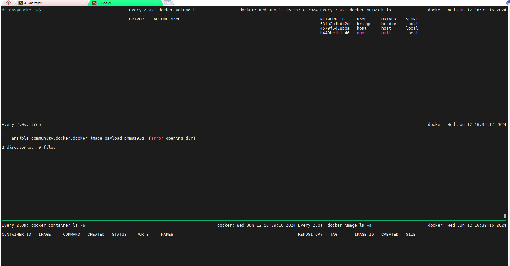
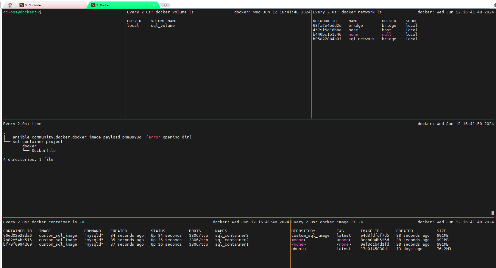

# To create three SQL containers along with a new volume and a new network.
### Environment Setup
- I am using two servers where I have configured Ansible and Docker, and below are the details.

> Ansible Server :

```ini
[dc-ops@controller ~]$ hostname
controller
[dc-ops@controller ~]$ cat /etc/os-release
NAME="Red Hat Enterprise Linux"
VERSION="9.2 (Plow)"
```

> Docker Server:

```ini
dc-ops@docker:~$ hostname
docker
dc-ops@docker:~$ cat /etc/os-release
PRETTY_NAME="Ubuntu 24.04 LTS"
NAME="Ubuntu"
```

 ### Following is the project folder directory
 

### Explanation:

#### 01. Project Structure:

- Ansible/: Contains the Ansible configuration, inventory, and playbook files.
- Docker/: Contains the Dockerfile to build the custom SQL container image.

#### 02. Ansible Configuration (ansible.cfg):

- Configures Ansible to use the specified inventory file.

#### 03. Inventory File:

Specifies the docker host where the containers will be deployed.

#### 04. Playbook:

- Ensures that the Docker network and volume exist.
- Builds a Docker image from the Dockerfile.
- Creates three SQL containers using the built Docker image, attaching them to the  created network and volume.

#### 05. Dockerfile:

- Uses Ubuntu as the base image.
- Installs MySQL server.
- Exposes port 3306 for MySQL.
- Sets the default command to run the MySQL server.

## Before Deploy Container:


##### Playbook outcomes:


## After deploy container, how it looks.

