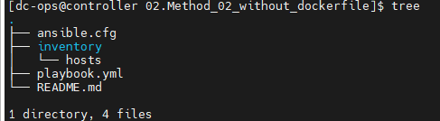
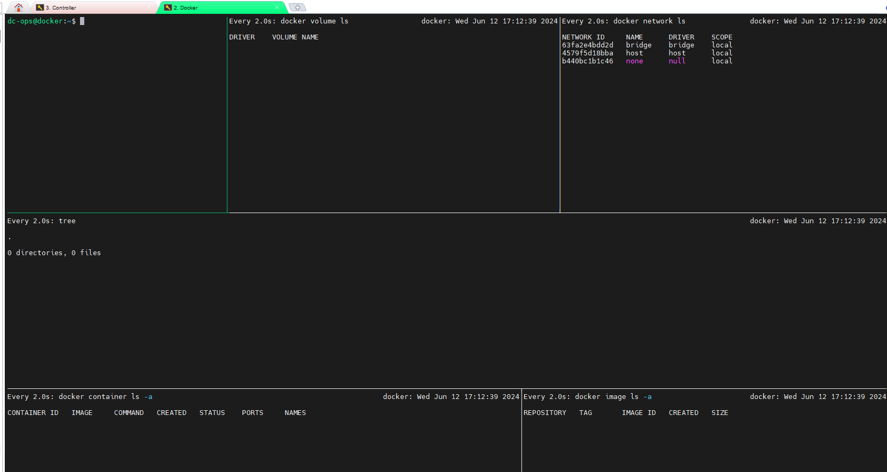
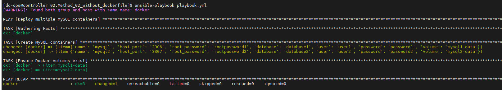
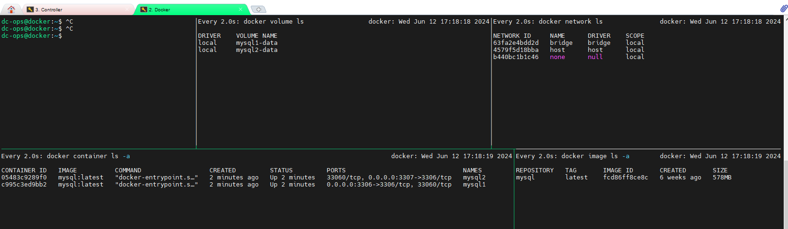

# To create Two SQL containers along with a new volume

### Environment Setup
- I am using two servers where I have configured Ansible and Docker, and below are the details.

- Ansible Server :

```ini
[dc-ops@controller ~]$ hostname
controller
[dc-ops@controller ~]$ cat /etc/os-release
NAME="Red Hat Enterprise Linux"
VERSION="9.2 (Plow)"
```

- Docker Server:

```ini
dc-ops@docker:~$ hostname
docker
dc-ops@docker:~$ cat /etc/os-release
PRETTY_NAME="Ubuntu 24.04 LTS"
NAME="Ubuntu"
```
### Following is the project folder directory
 

## Explanation:

#### 01. Ansible Configuration (ansible.cfg):

- Configures Ansible to use the specified inventory file.
```yml
defaults]
inventory = inventory/hosts
host_key_checking = False
```
#### 02. Inventory File:
Specifies the docker host where the containers will be deployed.
```bash
[docker] 
docker ansible_host=docker ansible_user=dc-ops
```
## Before Deploy Container:


#### Playbook outcomes:


## After deploy container, how it looks.

