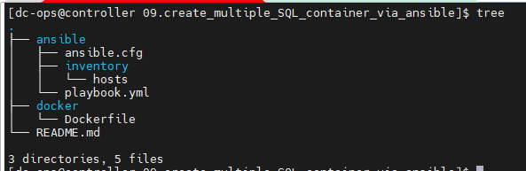
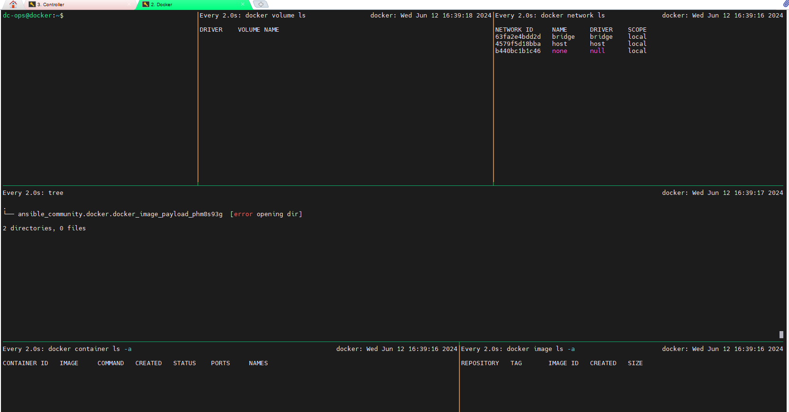
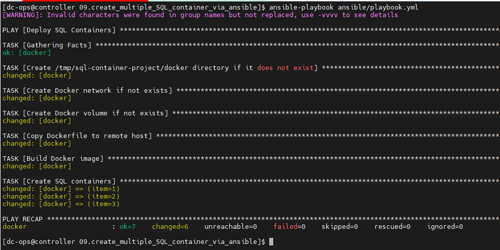
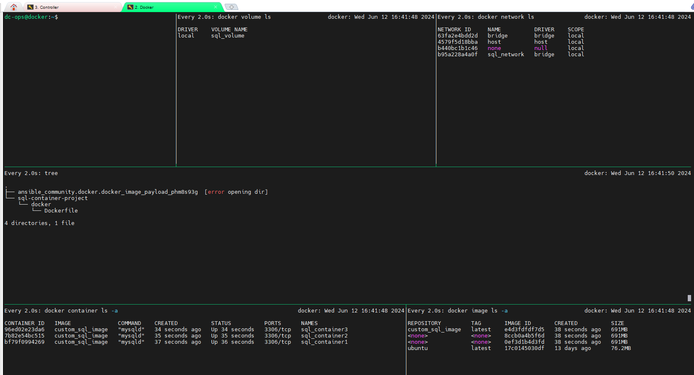

# To create three SQL containers along with a new volume and a new network.

 ### Following is the project folder directory
 

### Explanation:

#### 01. Project Structure:

- Ansible/: Contains the Ansible configuration, inventory, and playbook files.
- Docker/: Contains the Dockerfile to build the custom SQL container image.

#### 02. Ansible Configuration (ansible.cfg):

- Configures Ansible to use the specified inventory file.

#### 03. Inventory File:

Specifies the docker host where the containers will be deployed.

#### 04. Playbook:

- Installs Docker SDK for Python on the docker host.
- Ensures that the Docker network and volume exist.
- Builds a Docker image from the Dockerfile.
- Creates three SQL containers using the built Docker image, attaching them to the  created network and volume.

#### 05. Dockerfile:

- Uses Ubuntu as the base image.
- Installs MySQL server.
- Exposes port 3306 for MySQL.
- Sets the default command to run the MySQL server.

## Before Deploy Container:

##### Playbook outcomes:

## After deploy container, how it looks.

