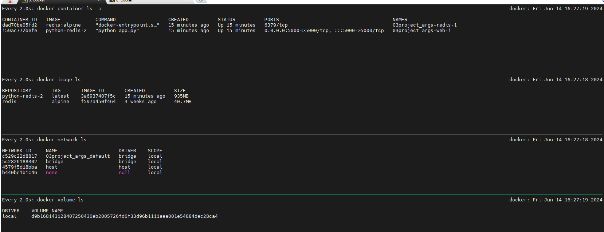

# Project: Sample Application via Compose
## Running Python/Flask application using a Redis database via ARG parameter.
*Folder structure:*
```css
.
├── aboutme.md
├── app.py
├── docker-compose.yml
├── Dockerfile
└── requirements.txt

1 directory, 5 files
```
### Understand how ARG and FROM interact : [_Ref link_](https://docs.docker.com/reference/dockerfile/?highlight=args)
```FROM``` instructions support variables that are declared by any ```ARG```instructions that occur before the first ```FROM```.

```bash
ARG  CODE_VERSION=latest
FROM base:${CODE_VERSION}
CMD  /code/run-app
FROM extras:${CODE_VERSION}
CMD  /code/run-extras
```
An ```ARG``` declared before a ```FROM``` is outside of a build stage, so it can't be used in any instruction after a ```FROM```. To use the default value of an ```ARG``` declared before the first ```FROM``` use an ARG instruction without a value inside of a build stage:

```bash
ARG VERSION=latest
FROM busybox:$VERSION
ARG VERSION
RUN echo $VERSION > image_version
```
 
 


## Now, we will try to deploy it with docker compose

```bash
docker compose up -d
```                                                                                
### outcomes:



### Delete the project
```bash
docker-compose down
```
```For a complete cleanup```, including volumes and networks, you can use:
```bash
docker stop $(docker ps -aq) && docker rm $(docker ps -aq) && docker rmi $(docker images -q) && docker volume prune -f && docker network prune -f
```
