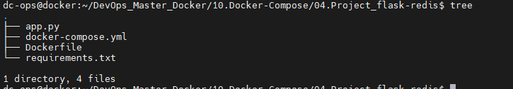
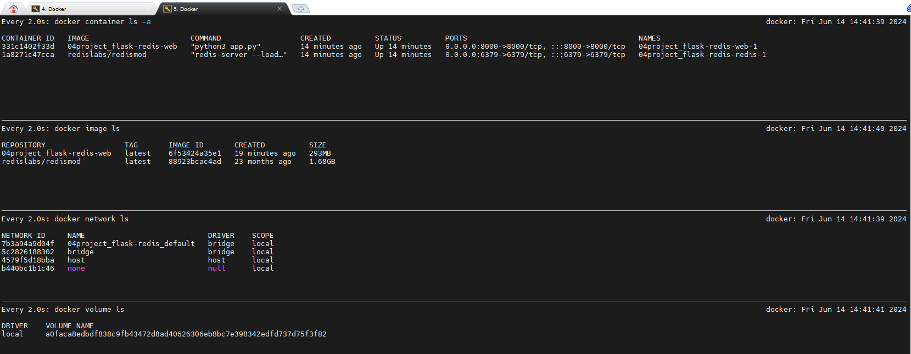
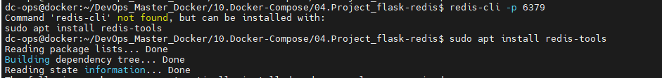

# Project: Sample Application via Compose
## Running Python/Flask application using a Redis database.

*Folder structure:*


## Now, we will try to deploy it with docker compose

```bash
docker compose up -d
```                                                                                
# Outcomes:



- Now, we will try to access `http://localhost:8000` in web browser: 

* Also, we can try to do __curl__ on docker machine:

```css
curl localhost:8000
This webpage has been viewed 1 time(s)
```

### We can also check all viewed details via Redis:


Will connect to redis database by using ```redis-cli``` command and monitor the all views history

*Keep in mind*: 

- ```redis-cli``` package should be installed on your machine, if it is not installed then it can be done via ```sudo apt install redis-tools```, below is the screenshot for more ref.



Now try to connect database on port ```6379```
```ini
redis-cli -p 6379
127.0.0.1:6379> 
```
You will get prompt like ```127.0.0.1:6379>``` now you need to type ```monitor``` and presh enter.

```ini
# It will be seen like below:
127.0.0.1:6379> monitor
OK
127.0.0.1:6379> monitor
OK
1718340796.481239 [0 172.25.0.3:33184] "INCRBY" "hits" "1"
1718340796.482010 [0 172.25.0.3:33184] "GET" "hits"
1718340797.983825 [0 172.25.0.3:33184] "INCRBY" "hits" "1"
1718340797.984698 [0 172.25.0.3:33184] "GET" "hits"
1718340798.642676 [0 172.25.0.3:33184] "INCRBY" "hits" "1"
1718340798.644719 [0 172.25.0.3:33184] "GET" "hits"
1718340799.152129 [0 172.25.0.3:33184] "INCRBY" "hits" "1"
1718340799.153718 [0 172.25.0.3:33184] "GET" "hits"
1718340799.620134 [0 172.25.0.3:33184] "INCRBY" "hits" "1"
1718340799.621544 [0 172.25.0.3:33184] "GET" "hits"
1718340800.134074 [0 172.25.0.3:33184] "INCRBY" "hits" "1"
1718340800.135654 [0 172.25.0.3:33184] "GET" "hits"
1718340800.590227 [0 172.25.0.3:33184] "INCRBY" "hits" "1"
1718340800.592685 [0 172.25.0.3:33184] "GET" "hits"
1718340801.025387 [0 172.25.0.3:33184] "INCRBY" "hits" "1"
1718340801.027332 [0 172.25.0.3:33184] "GET" "hits"
1718340801.436715 [0 172.25.0.3:33184] "INCRBY" "hits" "1"
1718340801.438055 [0 172.25.0.3:33184] "GET" "hits"
1718340801.845037 [0 172.25.0.3:33184] "INCRBY" "hits" "1"
1718340801.846314 [0 172.25.0.3:33184] "GET" "hits"
```

#### Now, we need to Stop and remove the containers by using the below command:
```bash
$ docker compose down
```