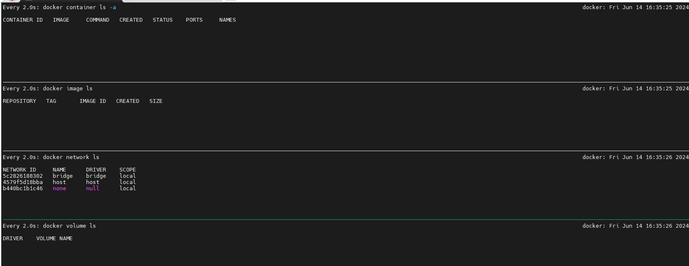
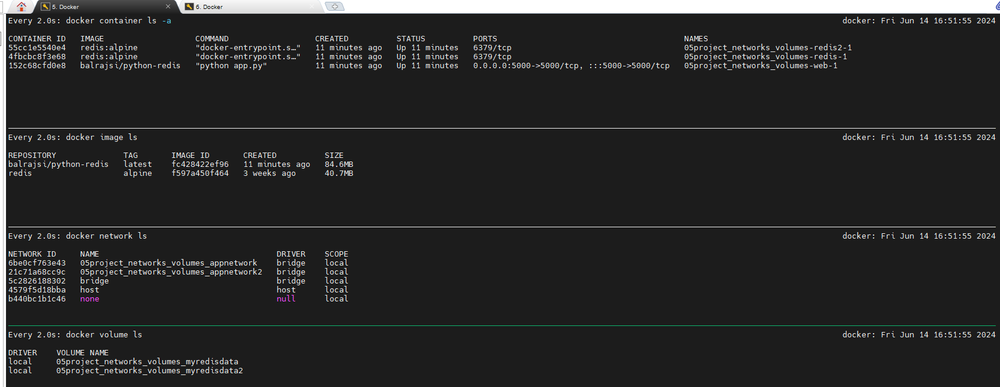

# Project: Sample Application with Volume and Nework via Compose
*Folder structure:*
```css
.
├── aboutme.md
├── app.py
├── docker-compose.yml
├── Dockerfile
└── requirements.txt

1 directory, 5 files
```
#### Status before execute the build:


__Compose file__ 

```yml
version: "3.7"
services:
  web:
    build:
      context: .
      dockerfile: Dockerfile
      args:
        - PYTHON_VERSION=3.4-alpine
    image: balrajsi/python-redis
    ports:
      - "5000:5000"
    networks:
      - appnetwork
  redis:
    image: "redis:alpine"
    volumes:
      - myredisdata:/data
    networks:
      - appnetwork

  redis2:
    image: "redis:alpine"
    volumes:
      - myredisdata2:/data
    networks:
      - appnetwork2
networks:
  appnetwork:
  appnetwork2:

volumes:
  myredisdata:
  myredisdata2:
```
### ```Explaination```: 
*We have defined three containers within the services section, each using a network and a volume. The network property will create two networks: appnetwork and appnetwork2. Similarly, the volumes property will create volumes inside the containers. Users can attach a network to any container, provided it is defined in the YAML file.*

## Now, we will try to deploy it with docker compose

```bash
docker compose up -d
```                                                                                
### outcomes:


### Delete the project
```bash
docker-compose down
```
```For a complete cleanup```, including volumes and networks, you can use:
```bash
docker stop $(docker ps -aq) && docker rm $(docker ps -aq) && docker rmi $(docker images -q) && docker volume prune -f && docker network prune -f
```