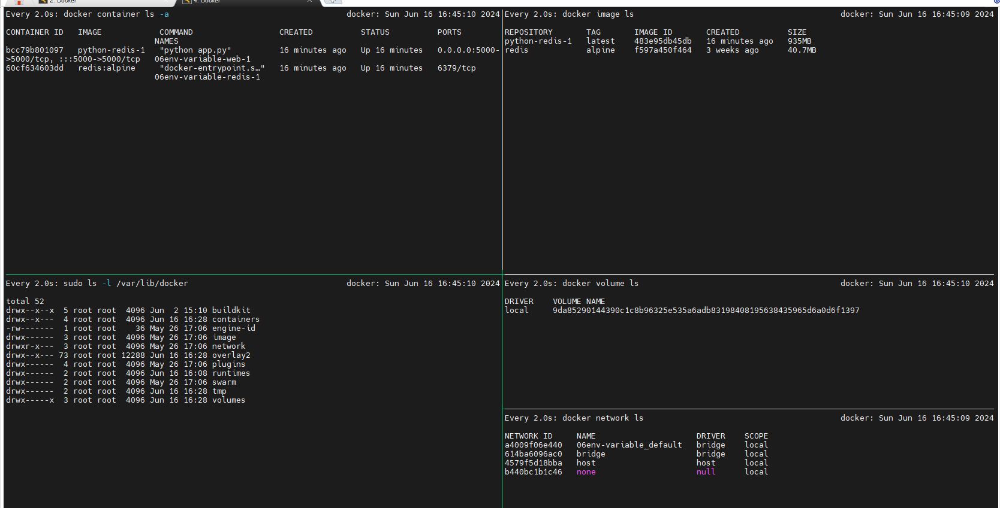

# How to use env variable via Compose

*Folder structure:*
```css
total 32
drwxrwxr-x 2 dc-ops dc-ops 4096 Jun 16 16:28 .
drwxrwxr-x 9 dc-ops dc-ops 4096 Jun 16 16:14 ..
-rw-rw-r-- 1 dc-ops dc-ops 1760 Jun 16 16:14 aboutme.md
-rw-rw-r-- 1 dc-ops dc-ops  349 Jun 16 16:14 app.py
-rw-rw-r-- 1 dc-ops dc-ops  239 Jun 16 16:28 docker-compose.yml
-rw-rw-r-- 1 dc-ops dc-ops  134 Jun 16 16:26 Dockerfile
-rw-rw-r-- 1 dc-ops dc-ops   44 Jun 16 16:22 .env
-rw-rw-r-- 1 dc-ops dc-ops   12 Jun 16 16:14 requirements.txt
```
__Compose file__ 
```yml
version: "3.7"
services:
  web:
    build:
     context: .
     dockerfile: Dockerfile
     args:
       - PYTHON_VERSION=${PYTHON_VERSION}
    image: python-redis-1
    ports:
      - "5000:5000"
  redis:
    image: ${REDIS_IMAGE}
```

### ```Explaination```: 

```*environment variable*``` can be checked in any container with below command:

```Docker-compose exec <container_name>```

*My case*:

```ini
dc-ops@docker:~/DevOps_Master_Docker/10.Docker-Compose/06.Env-Variable$ docker-compose exec web env
PATH=/usr/local/bin:/usr/local/sbin:/usr/local/bin:/usr/sbin:/usr/bin:/sbin:/bin
HOSTNAME=bcc79b801097
TERM=xterm
LANG=C.UTF-8
GPG_KEY=97FC712E4C024BBEA48A61ED3A5CA953F73C700D
PYTHON_VERSION=3.4.10    # ENV Variable value
PYTHON_PIP_VERSION=19.0.3 # ENV Variable value
HOME=/root
```

## Now, we will try to deploy it with docker compose
```bash
docker compose up -d
```                                                                                
### Outcomes:


### Delete the project
```bash
docker-compose down
```
```For a complete cleanup```, including volumes and networks, you can use:
```bash
1. docker stop $(docker ps -aq) && docker rm $(docker ps -aq) && docker rmi $(docker images -q) && docker volume prune -f && docker network prune -f
2. docker volume rm $(docker volume ls -q)
```
