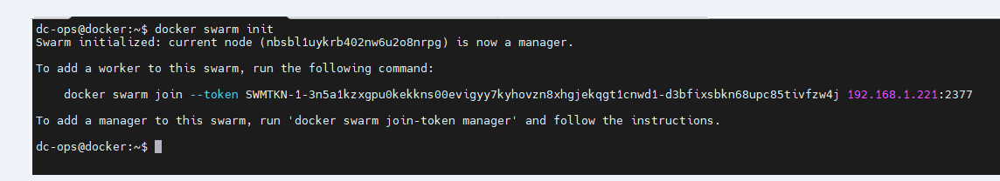

# Docker Swarm Installation on Ubuntu

Will create a ```three node cluster```in docker Swarm

*My Lab-Setup*: 
```yml
docker: 192.168.1.221    # MasterNode
worker01: 192.168.1.222  # Worker 
worker02: 192.168.1.223   # worker
```
> First will make an entry in the host file, so that node can be accessible via hostname.
```ini
cat <<- "EOF" >> /etc/hosts
192.168.1.221 docker
192.168.1.222 worker01
192.168.1.223 worker02
EOF
```
> Also, we need to use password-less authentication.

```css
cat /etc/ssh/sshd_config | grep "PasswordAuthentication"
echo "PasswordAuthentication yes" >> /etc/ssh/sshd_config
cat /etc/ssh/sshd_config | grep "PasswordAuthentication"

cat /etc/ssh/sshd_config | grep "PermitRootLogin"
echo "PermitRootLogin yes"  >> /etc/ssh/sshd_config
cat /etc/ssh/sshd_config | grep "PermitRootLogin"
```
> Now we will add your user (I used ```dev-ops```) to the sudoers file.

```css
cat <<- "EOF" >> /etc/sudoers 
dev-ops ALL=(ALL) NOPASSWD: ALL'
EOF
```
### Install docker using the apt repository :
ref: https://docs.docker.com/engine/install/ubuntu/#install-using-the-repository

will create a ```install.sh``` file and add the following line: 
```ini
# Add Docker's official GPG key:
sudo apt-get update
sudo apt-get install ca-certificates curl
sudo install -m 0755 -d /etc/apt/keyrings
sudo curl -fsSL https://download.docker.com/linux/ubuntu/gpg -o /etc/apt/keyrings/docker.asc
sudo chmod a+r /etc/apt/keyrings/docker.asc

# Add the repository to Apt sources:
echo \
  "deb [arch=$(dpkg --print-architecture) signed-by=/etc/apt/keyrings/docker.asc] https://download.docker.com/linux/ubuntu \
  $(. /etc/os-release && echo "$VERSION_CODENAME") stable" | \
  sudo tee /etc/apt/sources.list.d/docker.list > /dev/null
sudo apt-get update
```
Will give the executable permission to file.
```bash
chmod +x install.sh
```

> Now, I'll install Docker on all nodes (docker, worker01, and worker02).

```bash
sudo apt-get install docker-ce docker-ce-cli containerd.io docker-buildx-plugin docker-compose-plugin
```

> Will add the user to the Docker group:
```bash
sudo usermod -aG docker $USER
```
> Verify the Docker service status on all nodes.
```bash
service docker status
```
> will verify swarm service status on master (docker host).
```bash
docker info | head 50 
or
docker info | grep -i "Swarm"
```
If you found ```inactive``` then you are free to install Swarn on the master node.


> Now, we will be installing ```Docker Swarm``` on the master node.
```bash
docker swarm init
```

It will give you similar outcome (token would be different in your case ;-))-



Now that it is time to add workers to the cluster, we will use the same ```token``` that was generated during swarn installation.

To add a worker into cluster, run the following command:
```bash
docker swarm join --token SWMTKN-1-3n5a1kzxgpu0kekkns00evigyy7kyhovzn8xhgjekqgt1cnwd1-d3bfixsbkn68upc85tivfzw4j 192.168.1.221:2377
```
*Please check the ```token``` in your case.*


To check the cluster status:
```bash
docker node ls
```
```ini
ID                            HOSTNAME   STATUS    AVAILABILITY   MANAGER STATUS   ENGINE VERSION
nbsbl1uykrb402nw6u2o8nrpg *   docker     Ready     Active         Leader           26.1.4
ujaei8lzxl3eqd0fy6vcivg19     worker01   Ready     Active                          26.1.4
s0kmcuvgcafhtylumweekwa72     worker02   Ready     Active                          26.1.4
```

### Cluster Status:


### *Note*: In case you forget the ```token``` for worker and master, it can be checked via the following command:

#### For worker
    docker swarm join-token worker
    
#### For Master
 ```bash
 docker swarm join-token worker
```
