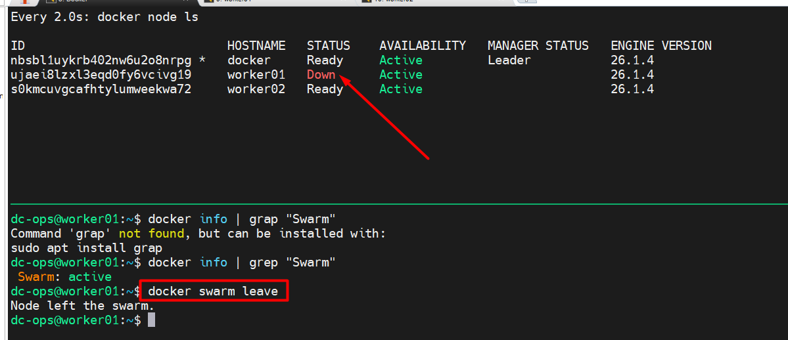

# Add Nodes In Docker Swarm

> will run the below command to check the token and will workder node into the cluster
```docker swarm join-token worker```

```bash
docker swarm join --token SWMTKN-1-3n5a1kzxgpu0kekkns00evigyy7kyhovzn8xhgjekqgt1cnwd1-d3bfixsbkn68upc85tivfzw4j 192.168.1.221:2377
```

> How to remove node from a cluster (I'll run the command on __worker01__)

* first we will check the ```swarm``` status

```yml
docker info | grep "Swarm"

dc-ops@worker01:~$ docker info | grep "Swarm"
 Swarm: active
```
Now, we will use the following command to leave worker01 from cluster
```bash
docker swarm leave
```
> How it looks on the master after executing the leave command from the worker.



> will validate the swarm status on worker 01

```yml
dc-ops@worker01:~$ docker info | grep "Swarm"
 Swarm: active

dc-ops@worker01:~$ docker swarm leave
Node left the swarm.

dc-ops@worker01:~$ docker info | grep "Swarm"
 Swarm: inactive
dc-ops@worker01:~$
```

> How to node out of a cluster

*Command should be run on master node*, we have removed ```worker01``` from cluster.

```bash
$ docker node rm worker01
worker01

$docker node ls
ID                            HOSTNAME   STATUS    AVAILABILITY   MANAGER STATUS   ENGINE VERSION
nbsbl1uykrb402nw6u2o8nrpg *   docker     Ready     Active         Leader           26.1.4
s0kmcuvgcafhtylumweekwa72     worker02   Ready     Active                          26.1.4
```

You can directly remove the worker from the master node using the ```-f``` parameter, but the worker still believes that he is part of the cluster, but you have to remove the command from the worker as well to remove the worker from the cluster.

> From Master Node
```bash
dc-ops@docker:~$ docker node rm worker02
Error response from daemon: rpc error: code = FailedPrecondition desc = node s0kmcuvgcafhtylumweekwa72 is not down and can't be removed

# You will get error message, because node should be in ```down``` state. Now, we will use -f parameter.

dc-ops@docker:~$ docker node rm -f worker02
worker02
dc-ops@docker:~$
```

> Status from worker node
```bash
dc-ops@worker02:~$ docker info | grep "Swarm"
 Swarm: active
```
now, we have to remove the node.
```bash
dc-ops@worker02:~$ docker swarm leave
Node left the swarm.

# To check the swarm status
dc-ops@worker02:~$ docker info | grep "Swarm"
 Swarm: inactive
``` 

