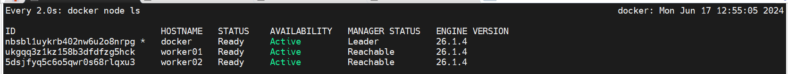
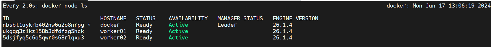

# Promote a Worker Node To Master

> You can inspect the worker via using below command
```bash
docker node inspect worker01 | less
docker node inspect worker02 | less
```

> You can promote any worker node to manager status at any time. To promote a node, run the below command on the manager node:

-  __Note__: *Docker recommend that cluster manager should be in ```1,3,5,7...``` and so on.*

```bash
$ docker node promote worker01 worker02
Node worker01 promoted to a manager in the swarm.
Node worker02 promoted to a manager in the swarm.
```
Current cluster status after promoting both workers

 

__Note__: You can't run docker master command on workers until you promote into manager.


> You can inspect the worker to know the roles by using the following command: ```docker node inspect worker01 | grep -A 5 "Spec"```
```bash
dc-ops@worker01:~$ docker node inspect worker01 | grep -A 5 "Spec"
        "Spec": {
            "Labels": {},
            "Role": "manager",   # See it is promoted to Manager
            "Availability": "active"
        },
        "Description": {
```

# Demote a Worker Node from Master
 
 Will check the current cluster status.
 ```bash
 docker node ls
 ```

 To demote worker node (```will run the command from master node```)
 ```bash
docker node demote worker01 worker02
```
Current state:


You can inspect the worker:
```bash
$ docker node inspect worker01 | grep -A 5 "Spec"
        "Spec": {
            "Labels": {},
            "Role": "worker",  # See it is demoted
            "Availability": "active"
        },
        "Description": {
```