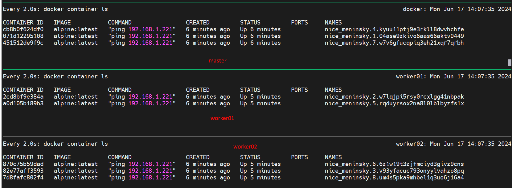
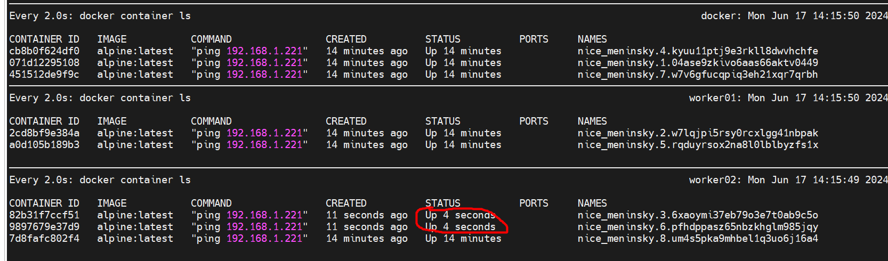

# How to deploy a Replica Services in Docker Swarm

> A replicated service in Docker Swarm is designed to run a specified number of identical instances, or replicas, of a Docker container. To create a new service with 8 replicas, you can use the Docker command with the appropriate service creation options. 

Here is the command to achieve this:

```bash
docker service create --replicas 8 [OPTIONS] IMAGE [COMMAND] [ARG...]
```
In this command:
```bash
' --replicas 8 specifies that the service should have four replicas.
' [OPTIONS] can be replaced with any additional options you need.
' IMAGE is the name of the Docker image you want to use.
' [COMMAND] [ARG...] allows you to specify a command and its arguments to run inside the container.
```
```bash
docker service create -d --replicas 8 alpine ping 192.168.1.221
```

> To check all the containers replicas deployed by the service using the below command
```css
$ docker service ls
ID             NAME            MODE         REPLICAS   IMAGE           PORTS
0r8cjf9eeyzd   nice_meninsky   replicated   8/8        alpine:latest
```
To check the status service status , will use (```docker service ps <service ID>```)
```css
$ docker service ps 0r8cjf9eeyzd   
ID             NAME              IMAGE           NODE       DESIRED STATE   CURRENT STATE           ERROR     PORTS
04ase9zkivo6   nice_meninsky.1   alpine:latest   docker     Running         Running 2 minutes ago
w7lqjpi5rsy0   nice_meninsky.2   alpine:latest   worker01   Running         Running 2 minutes ago
v93yfacuc793   nice_meninsky.3   alpine:latest   worker02   Running         Running 2 minutes ago
kyuu11ptj9e3   nice_meninsky.4   alpine:latest   docker     Running         Running 2 minutes ago
rqduyrsox2na   nice_meninsky.5   alpine:latest   worker01   Running         Running 2 minutes ago
6z1w19t3zjfm   nice_meninsky.6   alpine:latest   worker02   Running         Running 2 minutes ago
w7v6gfucqpiq   nice_meninsky.7   alpine:latest   docker     Running         Running 2 minutes ago
um4s5pka9mhb   nice_meninsky.8   alpine:latest   worker02   Running         Running 2 minutes ago
```
> Currently, ```two containers``` are operating on __worker01__, ```Three container``` is running on the __master node__, and ```three container``` is active on __worker02__.


> If we delete any two containers from worker 02, then they would be auto-created because we have set the replica to 8 and it is managed by Docker Swarm.

Current container status from ```Worker02```
```bash
CONTAINER ID   IMAGE           COMMAND                CREATED          STATUS          PORTS     NAMES
870c75b59dad   alpine:latest   "ping 192.168.1.221"   10 minutes ago   Up 10 minutes             nice_meninsky.6.6z1w19t3zjfmciyd3givz9cns
82e77aff3593   alpine:latest   "ping 192.168.1.221"   10 minutes ago   Up 10 minutes             nice_meninsky.3.v93yfacuc793onyylvahzo8pq
7d8fafc802f4   alpine:latest   "ping 192.168.1.221"   10 minutes ago   Up 10 minutes             nice_meninsky.8.um4s5pka9mhbel1q3uo6j16a4
```

we are deleting ```870c75b59dad``` and ```82e77aff3593```

```bash
docker container rm -f 870c75b59dad 82e77aff359
```
now, status


##### As a result, the Docker service on the manager node will start 2 more containers, maintaining the total number of replicas at 8. This process ensures that the Docker Swarm manager keeps the cluster running in its desired state.