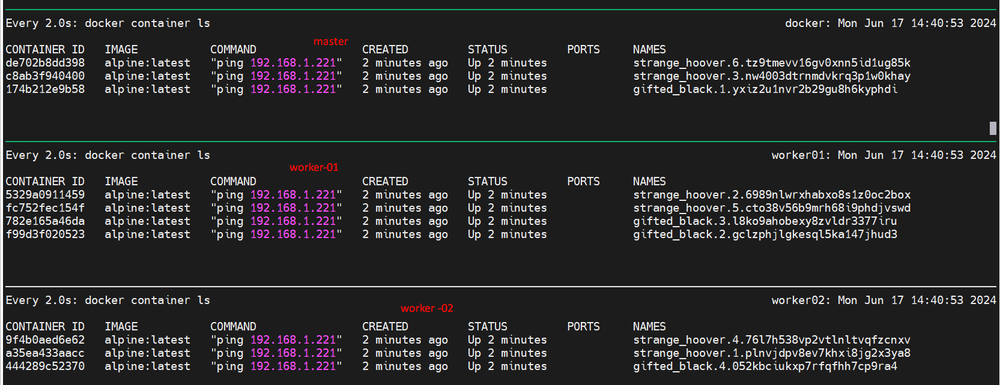
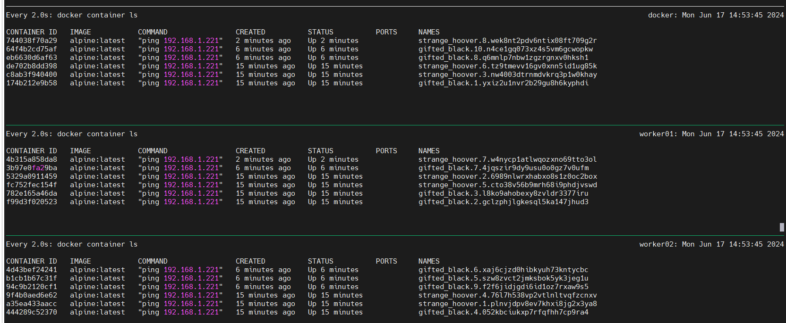
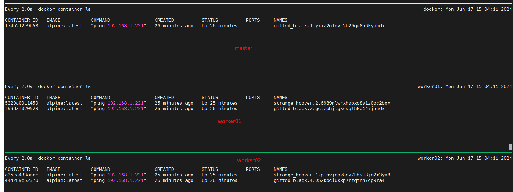

# When you've deployed a service to a swarm and wish to scale up or decrease the number of containers in it, use the docker service scale command.

> Command to scale up the service -

```bash
docker service scale <SERVICE-ID>=<NUMBER-OF-TASKS>
```
We will construct two services with four and six replicas, accordingly.

```css
$ docker service create -d --replicas 4 alpine ping 192.168.1.221
cj74oxt49rz9hn187ebqoh7dn

$ docker service create -d --replicas 6 alpine ping 192.168.1.221
w6rzhoah4g8tql8ioy2zk0ee0
```
Docker service status
```bash
$ docker service ls
ID             NAME             MODE         REPLICAS   IMAGE           PORTS
cj74oxt49rz9   gifted_black     replicated   4/4        alpine:latest
w6rzhoah4g8t   strange_hoover   replicated   6/6        alpine:latest
```
Distribution of replica amoung cluster
```css
$ docker service ps cj74oxt49rz9
ID             NAME             IMAGE           NODE       DESIRED STATE   CURRENT STATE           ERROR     PORTS
yxiz2u1nvr2b   gifted_black.1   alpine:latest   docker     Running         Running 5 minutes ago
gclzphjlgkes   gifted_black.2   alpine:latest   worker01   Running         Running 5 minutes ago
l8ko9ahobexy   gifted_black.3   alpine:latest   worker01   Running         Running 5 minutes ago
052kbciukxp7   gifted_black.4   alpine:latest   worker02   Running         Running 5 minutes ago


$ docker service ps w6rzhoah4g8t
ID             NAME               IMAGE           NODE       DESIRED STATE   CURRENT STATE           ERROR     PORTS
plnvjdpv8ev7   strange_hoover.1   alpine:latest   worker02   Running         Running 4 minutes ago
6989nlwrxhab   strange_hoover.2   alpine:latest   worker01   Running         Running 4 minutes ago
nw4003dtrnmd   strange_hoover.3   alpine:latest   docker     Running         Running 4 minutes ago
76l7h538vp2v   strange_hoover.4   alpine:latest   worker02   Running         Running 4 minutes ago
cto38v56b9mr   strange_hoover.5   alpine:latest   worker01   Running         Running 4 minutes ago
tz9tmevv16gv   strange_hoover.6   alpine:latest   docker     Running         Running 4 minutes ago

```


To scale the service starting cj74oxt49rz9 & w6rzhoah4g8t , use below command:
``` docker serrvice scale <service ID>=value```

we are scalling to ```10``` from ```4``` for service "cj74oxt49rz9"
```bash
$ docker service scale cj74oxt49rz9=10


cj74oxt49rz9 scaled to 10
overall progress: 10 out of 10 tasks
1/10: running   [==================================================>]
2/10: running   [==================================================>]
3/10: running   [==================================================>]
4/10: running   [==================================================>]
5/10: running   [==================================================>]
6/10: running   [==================================================>]
7/10: running   [==================================================>]
8/10: running   [==================================================>]
9/10: running   [==================================================>]
10/10: running   [==================================================>]
verify: Service cj74oxt49rz9 converged
```
```bash
$ docker service ls
ID             NAME             MODE         REPLICAS   IMAGE           PORTS
cj74oxt49rz9   gifted_black     replicated   10/10      alpine:latest
w6rzhoah4g8t   strange_hoover   replicated   6/6        alpine:latest
```

> Distribution 

```bash
$ docker service ps cj74oxt49rz9

ID             NAME              IMAGE           NODE       DESIRED STATE   CURRENT STATE                ERROR     PORTS
yxiz2u1nvr2b   gifted_black.1    alpine:latest   docker     Running         Running 10 minutes ago
gclzphjlgkes   gifted_black.2    alpine:latest   worker01   Running         Running 10 minutes ago
l8ko9ahobexy   gifted_black.3    alpine:latest   worker01   Running         Running 10 minutes ago
052kbciukxp7   gifted_black.4    alpine:latest   worker02   Running         Running 10 minutes ago
szw8zvct2jmk   gifted_black.5    alpine:latest   worker02   Running         Running about a minute ago
xaj6cjzd0hib   gifted_black.6    alpine:latest   worker02   Running         Running about a minute ago
4jqszir9dy9u   gifted_black.7    alpine:latest   worker01   Running         Running about a minute ago
q6mnlp7nbw1z   gifted_black.8    alpine:latest   docker     Running         Running about a minute ago
f2f6jidjgdi6   gifted_black.9    alpine:latest   worker02   Running         Running about a minute ago
n4ce1gq073xz   gifted_black.10   alpine:latest   docker     Running         Running about a minute ago
```

> we are scalling to ```8``` from ```6``` for service "w6rzhoah4g8t"

```bash
docker service scale w6rzhoah4g8t=8

w6rzhoah4g8t scaled to 8
overall progress: 8 out of 8 tasks
1/8: running   [==================================================>]
2/8: running   [==================================================>]
3/8: running   [==================================================>]
4/8: running   [==================================================>]
5/8: running   [==================================================>]
6/8: running   [==================================================>]
7/8: running   [==================================================>]
8/8: running   [==================================================>]
verify: Service w6rzhoah4g8t converged
```

```bash
$ docker service ls
ID             NAME             MODE         REPLICAS   IMAGE           PORTS
cj74oxt49rz9   gifted_black     replicated   10/10      alpine:latest
w6rzhoah4g8t   strange_hoover   replicated   8/8        alpine:latest
```

Distribution:
```bash
$ docker service ps w6rzhoah4g8t
ID             NAME               IMAGE           NODE       DESIRED STATE   CURRENT STATE                ERROR     PORTS
plnvjdpv8ev7   strange_hoover.1   alpine:latest   worker02   Running         Running 13 minutes ago
6989nlwrxhab   strange_hoover.2   alpine:latest   worker01   Running         Running 14 minutes ago
nw4003dtrnmd   strange_hoover.3   alpine:latest   docker     Running         Running 14 minutes ago
76l7h538vp2v   strange_hoover.4   alpine:latest   worker02   Running         Running 13 minutes ago
cto38v56b9mr   strange_hoover.5   alpine:latest   worker01   Running         Running 14 minutes ago
tz9tmevv16gv   strange_hoover.6   alpine:latest   docker     Running         Running 14 minutes ago
w4nycp1atlwq   strange_hoover.7   alpine:latest   worker01   Running         Running about a minute ago
wek8nt2pdv6n   strange_hoover.8   alpine:latest   docker     Running         Running about a minute ago
```



## To scale (up /down) both the service at a time, use below command:

> In my case, I am doing ```scale down```.

Current service scale status
```css
$ docker service ls
ID             NAME             MODE         REPLICAS   IMAGE           PORTS
cj74oxt49rz9   gifted_black     replicated   10/10      alpine:latest
w6rzhoah4g8t   strange_hoover   replicated   8/8        alpine:latest
```

> For service```cj74oxt49rz9``` to ```3``` from 10

> For service```w6rzhoah4g8t``` to ```2``` from 8

```bash
docker service scale cj74oxt49rz9=3 w6rzhoah4g8t=2
```
```css
$ docker service scale cj74oxt49rz9=3 w6rzhoah4g8t=2
cj74oxt49rz9 scaled to 3
w6rzhoah4g8t scaled to 2
overall progress: 3 out of 3 tasks
1/3: running   [==================================================>]
2/3: running   [==================================================>]
3/3: running   [==================================================>]
verify: Service cj74oxt49rz9 converged
overall progress: 2 out of 2 tasks
1/2: running   [==================================================>]
2/2: running   [==================================================>]
verify: Service w6rzhoah4g8t converged
```
### Final outcomes:
```bash
$ docker service ls
ID             NAME             MODE         REPLICAS   IMAGE           PORTS
cj74oxt49rz9   gifted_black     replicated   3/3        alpine:latest
w6rzhoah4g8t   strange_hoover   replicated   2/2        alpine:latest
```

