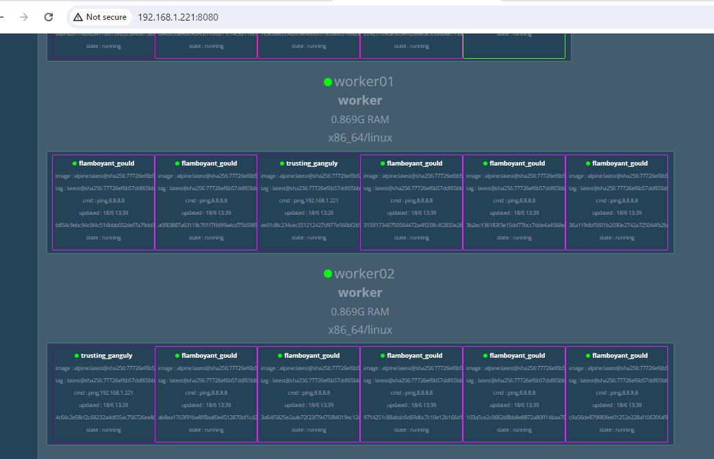

# Docker Service Mode (Replicated, global)

### Terminology:
- Docker Swarm: Docker Swarm is a Docker orchestration platform that enables the management and scaling of distributed applications across multiple containers.
- Global Service: A type of service in Docker Swarm that ensures exactly one task of the service is scheduled on each node in the cluster.
- Node: A node is an individual machine that is part of a Docker Swarm cluster and runs containers.
- Swarm Initiation: The process of initializing a Docker Swarm on a host, designating it as the Swarm manager.
- Worker Node: A node in the Docker Swarm cluster that runs application tasks, managed by the manager node.
- Manager Node: A node in the Docker Swarm cluster that coordinates and manages cluster operations, including service scheduling and worker node management.
- Docker Swarm Visualizer: A tool that provides a real-time visual representation of the architecture of a Docker Swarm cluster, making it easy to understand services and nodes.
- Docker Daemon: The Docker daemon is a background process that manages the building, running, and distribution of Docker containers.

Docker Swarm Visualizer

[Swarm mode overview](https://docs.docker.com/engine/swarm/) 

To run in a docker swarm:
```bash
$ docker service create \
  --name=viz \
  --publish=8080:8080/tcp \
  --constraint=node.role==manager \
  --mount=type=bind,src=/var/run/docker.sock,dst=/var/run/docker.sock \
  dockersamples/visualizer
  ```

  Once visualizer is installed then try to access it via port 8080

```bash
  $ docker service ls
ID             NAME      MODE         REPLICAS   IMAGE                              PORTS
zqgocy2o1w2w   viz       replicated   1/1        dockersamples/visualizer:latest   *:8080->8080/tcp
```

My lab docker host IP is 
```css
ens32: flags=4163<UP,BROADCAST,RUNNING,MULTICAST>  mtu 1500
        inet 192.168.1.221  netmask 255.255.255.0  broadcast 192.168.1.255
        inet6 fe80::20c:29ff:fed7:1c  prefixlen 64  scopeid 0x20<link>
        ether 00:0c:29:d7:00:1c  txqueuelen 1000  (Ethernet)
        RX packets 55560  bytes 69353457 (69.3 MB)
        RX errors 0  dropped 0  overruns 0  frame 0
        TX packets 24255  bytes 2358951 (2.3 MB)
        TX errors 0  dropped 0 overruns 0  carrier 0  collisions 0
```
 we will try to access it via ```192.168.1.221:8080```


*Scenario 01*: If we want to create a container and it should be run on a different node, then what will we do?

```bash
$ docker service create --mode=global alpine ping 192.168.1.221
yhyzujhxb22fxmpqfx2p7l3iw
overall progress: 3 out of 3 tasks
5dsjfyq5c6o5: running   [==================================================>]
nbsbl1uykrb4: running   [==================================================>]
ukgqq3z1kz15: running   [==================================================>]
verify: Service yhyzujhxb22fxmpqfx2p7l3iw converged
```

In visualizer, how it looks like:


*Scenario 02*: What If we want to create a single container and it should be run on a different node, then what will we do?

__Use case__: If you have to run any services like antivirus or monitoring on each node, then it will come into global mode.


## Docker Swarm Label and Constraint

> We will create three replicas and want to run them on master only. Then we will use the following command: ```docker service create --replicas=3 --constraint="node.role==manager" alpine ping 8.8.8.8```
```bash
$ docker service create --replicas=3 --constraint="node.role==manager" alpine ping 8.8.8.8

hs5l9qwtqrymoa0csci6kx1y8
overall progress: 3 out of 3 tasks
1/3: running   [==================================================>]
2/3: running   [==================================================>]
3/3: running   [==================================================>]
verify: Service hs5l9qwtqrymoa0csci6kx1y8 converged
```
In visualizer, how it looks like:


> We will create three replicas and want to run them on master only. Then we will use the following command: ```docker service create --replicas=10 --constraint="node.role==worker" alpine ping 8.8.8.8```

```bash
$ docker service create --replicas=10 --constraint="node.role==worker" alpine ping 8.8.8.8

6il0kfq4hxu4vyeg17w3srp7r
overall progress: 10 out of 10 tasks
1/10: running   [==================================================>]
2/10: running   [==================================================>]
3/10: running   [==================================================>]
4/10: running   [==================================================>]
5/10: running   [==================================================>]
6/10: running   [==================================================>]
7/10: running   [==================================================>]
8/10: running   [==================================================>]
9/10: running   [==================================================>]
10/10: running   [==================================================>]
verify: Service 6il0kfq4hxu4vyeg17w3srp7r converged
```
In visualizer, how it looks like:


*Scenario 03*: What If we want to create a containers with higher performance and it should be run on a ```worker01``` node only, then what will we do?

__Note__: will use ```custom lable``` for this task.

```bash
$ docker node update --help | grep label
      --label-add list        Add or update a node label ("key=value")
      --label-rm list         Remove a node label if exists
```

- first we will define the labels to ```worker01```

```bash
$ docker node update --label-add="ssd=true" worker01

worker01
```
In visualizer, how it looks like:


> Now, we will create service where ssd=ture matches and will create a container on it.
```bash
$ docker service create --constraint="node.labels.ssd==true" --replicas=10 -d alpine ping 8.8.8.8
kkfh4ibjliatwnb3ndx1n5cku
```

```css
$ docker service ls
ID             NAME                    MODE         REPLICAS   IMAGE                             PORTS
kkfh4ibjliat   compassionate_murdock   replicated   10/10      alpine:latest
6il0kfq4hxu4   flamboyant_gould        replicated   10/10      alpine:latest
hs5l9qwtqrym   inspiring_keller        replicated   3/3        alpine:latest
yhyzujhxb22f   trusting_ganguly        global       3/3        alpine:latest
zqgocy2o1w2w   viz                     replicated   1/1        dockersamples/visualizer:latest   *:8080->8080/tcp
```
In visualizer, how it looks like:
```bash
$ docker service ps kkfh4ibjliat
ID             NAME                       IMAGE           NODE       DESIRED STATE   CURRENT STATE           ERROR     PORTS
97mu37gnaxo6   compassionate_murdock.1    alpine:latest   worker01   Running         Running 2 minutes ago
mthi3d3dm534   compassionate_murdock.2    alpine:latest   worker01   Running         Running 2 minutes ago
1t1tsrkxor58   compassionate_murdock.3    alpine:latest   worker01   Running         Running 2 minutes ago
td3hbwsch5pe   compassionate_murdock.4    alpine:latest   worker01   Running         Running 2 minutes ago
5bdo0zh84ppt   compassionate_murdock.5    alpine:latest   worker01   Running         Running 2 minutes ago
ccrzfzqynurn   compassionate_murdock.6    alpine:latest   worker01   Running         Running 2 minutes ago
3ifek0f5kd0z   compassionate_murdock.7    alpine:latest   worker01   Running         Running 2 minutes ago
doim1n9ej6d2   compassionate_murdock.8    alpine:latest   worker01   Running         Running 2 minutes ago
5fy9jqf9digy   compassionate_murdock.9    alpine:latest   worker01   Running         Running 2 minutes ago
lljqev0o1klx   compassionate_murdock.10   alpine:latest   worker01   Running         Running 2 minutes ago
```


*Scenario 04*: What If we create the same label for ```worker02```, then Docker will move all existing containers that have the ```ssd=true``` label already attached. 

*Answer* is ```no``` because Docker manages only creation time.

Let's have a look, we are defining same label to ```worker02```

```css
$ docker node update --label-add="ssd=true" worker02

worker02
```


### How many types of Labels:
 

 *Scenario 04*:   ```docker node update --label-add="ssd=true" worker01``` this command can be run only master account, What if we don't have access to a master node and we have to assign the labels to a ```worker02``` node?

Here is ```two``` ways: 

- 01. ```docker node update --label-add="ssd=true" worker01```
- 02. We can assign the label at engine level, if we run the command to inspect to worker02 then we will see the below info.


> first we will go to node ```worker02``` then go to path ```/etc/docker``` and will create a file called ```daemon.json`` and content would below and restart the ```docker service```
```yml
{
        "labels" : ["name=authorised_Node"]  # You can give anyName
}
```
```bash
$ service docker restart
```


now will inspect the worker02 and will verify
```bash
docker node inspect worker02 | grep -A 10 Engin
```


Now, we will create a new service and will give the reference to our ```custom``` label. ```$ docker service create --constraint="engine.labels.name==authorised_node" --replicas=6 -d alpine ping 8.8.8.8```

```bash
$ docker service create --constraint="engine.labels.name==authorised_node" --replicas=6 -d alpine ping 8.8.8.8
sdtcbv37rhycorb53i3lg4td4
```

```bash
$ docker service ls
ID             NAME                    MODE         REPLICAS   IMAGE                             PORTS
kkfh4ibjliat   compassionate_murdock   replicated   10/10      alpine:latest
yd79h72plzu9   distracted_benz         replicated   0/6        alpine:latest
6il0kfq4hxu4   flamboyant_gould        replicated   10/10      alpine:latest
sdtcbv37rhyc   frosty_ellis            replicated   6/6        alpine:latest
hs5l9qwtqrym   inspiring_keller        replicated   3/3        alpine:latest
yhyzujhxb22f   trusting_ganguly        global       3/3        alpine:latest
zqgocy2o1w2w   viz                     replicated   1/1        dockersamples/visualizer:latest   *:8080->8080/tcp
```
```css
$ docker service ps sdtcbv37rhyc
ID             NAME             IMAGE           NODE       DESIRED STATE   CURRENT STATE                ERROR     PORTS
oiugslrlc9gn   frosty_ellis.1   alpine:latest   worker02   Running         Running about a minute ago
7r49hk4gaz5b   frosty_ellis.2   alpine:latest   worker02   Running         Running about a minute ago
uta7ig4lclmd   frosty_ellis.3   alpine:latest   worker02   Running         Running about a minute ago
1msc4lr1w576   frosty_ellis.4   alpine:latest   worker02   Running         Running about a minute ago
umcjotgn36n8   frosty_ellis.5   alpine:latest   worker02   Running         Running about a minute ago
gty2jh9n94oa   frosty_ellis.6   alpine:latest   worker02   Running         Running about a minute ago
```

In visualizer, how it looks like:


********************************************************
```css
$ docker service ls
ID             NAME               MODE         REPLICAS   IMAGE                             PORTS
yd79h72plzu9   distracted_benz    replicated   0/6        alpine:latest
6il0kfq4hxu4   flamboyant_gould   replicated   10/10      alpine:latest
sdtcbv37rhyc   frosty_ellis       replicated   6/6        alpine:latest
hs5l9qwtqrym   inspiring_keller   replicated   3/3        alpine:latest
yhyzujhxb22f   trusting_ganguly   global       3/3        alpine:latest
zqgocy2o1w2w   viz                replicated   1/1        dockersamples/visualizer:latest   *:8080->8080/tcp

```

### Addtional Command


> To remove all Docker services at once, you can use the following command, which stops and removes all services listed by ```docker service ls```:
```bash
docker service rm $(docker service ls -q)
```
Here is the command breakdown:

- docker service ls -q: Lists only the IDs of the services.
- docker service rm $(docker service ls -q): Removes all services using their IDs.

>> To remove all Docker services except one, you can use a combination of docker service ls and grep to filter out the service you want to keep, and then use xargs to remove the rest. Let's say you want to exclude the service with the NAME ```viz```.
```bash
docker service ls -q | grep -v $(docker service ls -q -f name=viz) | xargs docker service rm
```

Explanation:

- docker service ls -q: Lists all service IDs.
- grep -v $(docker service ls -q -f name=viz): Excludes the service ID of viz.
- xargs docker service rm: Removes all services listed (except viz).

