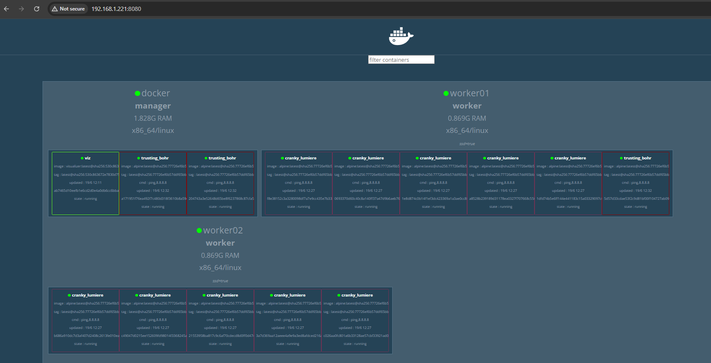
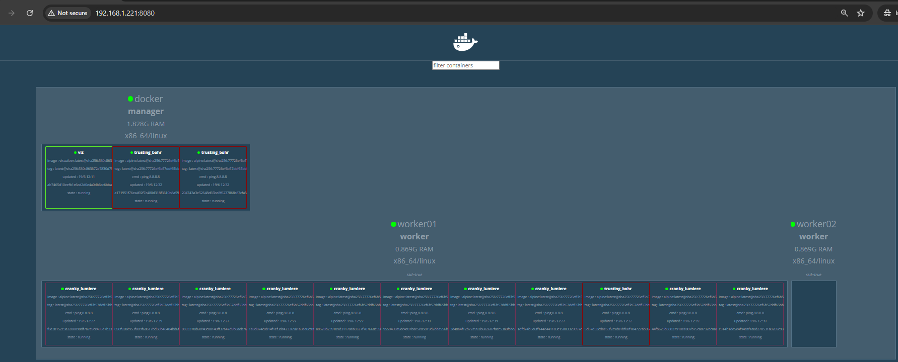

# Docker Swarm Node Availability

[Manage nodes in a swarm](https://docs.docker.com/engine/swarm/manage-nodes)

The ```AVAILABILITY``` column shows whether or not the scheduler can assign tasks to the node:

- ```Active``` means that the scheduler can assign tasks to the node.
- ```Pause``` means the scheduler doesn't assign new tasks to the node, but existing tasks remain running.

- ```Drain``` means the scheduler doesn't assign new tasks to the node. The scheduler shuts down any existing tasks and schedules them on an available node.

The ```MANAGER STATUS``` column shows node participation in the Raft consensus:

- No value indicates a worker node that does not participate in swarm management.
- ```Leader``` means the node is the primary manager node that makes all swarm management and orchestration decisions for the swarm.
- ```Reachable``` means the node is a manager node participating in the Raft consensus quorum. If the leader node becomes unavailable, the node is eligible for election as the new leader.
- ```Unavailable``` means the node is a manager that can't communicate with other managers. If a manager node becomes unavailable, you should either join a new manager node to the swarm or promote a worker node to be a manager.

> How to take help
```css
$ docker node update --help | grep avail

--availability string   Availability of the node ("active", "pause", "drain")
```
#### - My Lab: Current status of nodes.
```bash
$ docker node ls
ID                            HOSTNAME   STATUS    AVAILABILITY   MANAGER STATUS   ENGINE VERSION
nbsbl1uykrb402nw6u2o8nrpg *   docker     Ready     Active         Leader           26.1.4
ukgqq3z1kz158b3dfdfzg5hck     worker01   Ready     Active                          26.1.4
5dsjfyq5c6o5qwr0s68rlqxu3     worker02   Ready     Active                          26.1.4
```

#### - Will create a container first and will playaround with those.

```bash
dc-ops@docker:~$ docker service create --constraint="node.labels.ssd==true" --replicas=10 -d alpine ping 8.8.8.8
n1vdx41ydzmxapp5my9ozlawe


dc-ops@docker:~$ docker node ls
ID                            HOSTNAME   STATUS    AVAILABILITY   MANAGER STATUS   ENGINE VERSION
nbsbl1uykrb402nw6u2o8nrpg *   docker     Ready     Active         Leader           26.1.4
ukgqq3z1kz158b3dfdfzg5hck     worker01   Ready     Active                          26.1.4
5dsjfyq5c6o5qwr0s68rlqxu3     worker02   Ready     Active                          26.1.4


dc-ops@docker:~$ docker service ls
ID             NAME             MODE         REPLICAS   IMAGE                             PORTS
n1vdx41ydzmx   cranky_lumiere   replicated   10/10      alpine:latest
zqgocy2o1w2w   viz              replicated   1/1        dockersamples/visualizer:latest   *:8080->8080/tcp


dc-ops@docker:~$ docker service ps n1vdx41ydzmx
ID             NAME                IMAGE           NODE       DESIRED STATE   CURRENT STATE            ERROR     PORTS
os9rfmgl8idr   cranky_lumiere.1    alpine:latest   worker01   Running         Running 57 seconds ago
hpoh3jfueq74   cranky_lumiere.2    alpine:latest   worker01   Running         Running 57 seconds ago
0gi2z5ehjp0h   cranky_lumiere.3    alpine:latest   worker02   Running         Running 57 seconds ago
dp5h4h1gur7i   cranky_lumiere.4    alpine:latest   worker02   Running         Running 57 seconds ago
43ypnpq2ndfv   cranky_lumiere.5    alpine:latest   worker01   Running         Running 57 seconds ago
esq8sgu0i88f   cranky_lumiere.6    alpine:latest   worker02   Running         Running 57 seconds ago
q4lyu0pzzzn2   cranky_lumiere.7    alpine:latest   worker01   Running         Running 57 seconds ago
jnzdcphseoz5   cranky_lumiere.8    alpine:latest   worker02   Running         Running 57 seconds ago
q6f5neiqegoy   cranky_lumiere.9    alpine:latest   worker02   Running         Running 57 seconds ago
s86di06kpsxz   cranky_lumiere.10   alpine:latest   worker01   Running         Running 57 seconds ago
```

> Now, we will pause worker 02 and see if the existing container will move or not.

```docker node update --availability=pause <Node ID/Name>```

```css
dc-ops@docker:~$ docker node update --availability=pause worker02
worker02

dc-ops@docker:~$ docker node ls
ID                            HOSTNAME   STATUS    AVAILABILITY   MANAGER STATUS   ENGINE VERSION
nbsbl1uykrb402nw6u2o8nrpg *   docker     Ready     Active         Leader           26.1.4
ukgqq3z1kz158b3dfdfzg5hck     worker01   Ready     Active                          26.1.4
5dsjfyq5c6o5qwr0s68rlqxu3     worker02   Ready     Pause                           26.1.4
dc-ops@docker:~$
```

#### Inspect an individual node
You can run docker node inspect <NODE-ID> on a manager node to view the details for an individual node. The output defaults to JSON format, but you can pass the ```--pretty``` flag to print the results in human-readable format. 

For example:
```css
$ docker node inspect worker02 --pretty
ID:                     5dsjfyq5c6o5qwr0s68rlqxu3
Labels:
 - ssd=true
Hostname:               worker02
Joined at:              2024-06-17 02:46:32.57797288 +0000 utc
Status:
 State:                 Ready
 Availability:          Drain
 Address:               192.168.1.223
Platform:
 Operating System:      linux
 Architecture:          x86_64
Resources:
 CPUs:                  2
 Memory:                889.5MiB
Plugins:
 Log:           awslogs, fluentd, gcplogs, gelf, journald, json-file, local, splunk, syslog
 Network:               bridge, host, ipvlan, macvlan, null, overlay
 Volume:                local
Engine Version:         26.1.4
TLS Info:
 TrustRoot:
-----BEGIN CERTIFICATE-----
MIIBaTCCARCgAwIBAgIUDE1AYTMN7KfrVmbuFTIa0iw8YRgwCgYIKoZIzj0EAwIw
EzERMA8GA1UEAxMIc3dhcm0tY2EwHhcNMjQwNjE2MDc1MjAwWhcNNDQwNjExMDc1
MjAwWjATMREwDwYDVQQDEwhzd2FybS1jYTBZMBMGByqGSM49AgEGCCqGSM49AwEH
A0IABDMwlN5I0F5EBT7V/ROhJJzEWNR1TP9ujarrxEN8fS/eCRPYCOkUoTR3A3ek
JNDwixSHs7e5qlPnFKwIty8vgMajQjBAMA4GA1UdDwEB/wQEAwIBBjAPBgNVHRMB
Af8EBTADAQH/MB0GA1UdDgQWBBQhQsdP+LnyrIT8cm3rnyb2cjBRKTAKBggqhkjO
PQQDAgNHADBEAiAe5HeXvMe946ghyXoDLcigI46EE4ZlLPTkOXwc7s4zrQIgGKj1
Jn0mvArNqf5JjvrzhoRZLWPjeDwOOODGmZ4SWOc=
-----END CERTIFICATE-----

 Issuer Subject:        MBMxETAPBgNVBAMTCHN3YXJtLWNh
 Issuer Public Key:     MFkwEwYHKoZIzj0CAQYIKoZIzj0DAQcDQgAEMzCU3kjQXkQFPtX9E6EknMRY1HVM/26NquvEQ3x9L94JE9gI6RShNHcDd6Qk0PCLFIezt7mqU+cUrAi3Ly+Axg==
```

> We will create a new service to check whether we are getting new loads on worker 02 or not.

```bash
dc-ops@docker:~$ docker service create --replicas=3 -d alpine ping 8.8.8.8
usfhmih8whnk9wsss3jzwdd1j

dc-ops@docker:~$ docker service ls
ID             NAME             MODE         REPLICAS   IMAGE                             PORTS
n1vdx41ydzmx   cranky_lumiere   replicated   10/10      alpine:latest
usfhmih8whnk   trusting_bohr    replicated   3/3        alpine:latest
zqgocy2o1w2w   viz              replicated   1/1        dockersamples/visualizer:latest   *:8080->8080/tcp

dc-ops@docker:~$ docker service ps usfhmih8whnk
ID             NAME              IMAGE           NODE       DESIRED STATE   CURRENT STATE                ERROR     PORTS
td6ybu1bj43r   trusting_bohr.1   alpine:latest   worker01   Running         Running about a minute ago
xy5927tu523o   trusting_bohr.2   alpine:latest   docker     Running         Running about a minute ago
ucgj47ce5n43   trusting_bohr.3   alpine:latest   docker     Running         Running about a minute ago
dc-ops@docker:~$
```
__Note__: Rebalancing won't work here. Keep in mind.


> Now, we will activate the worker02  and see the workload.

```docker node update --availability=active <NODE ID/NAME>```

```bash
dc-ops@docker:~$ docker node update --availability=active worker02
worker02

dc-ops@docker:~$ docker node ls
ID                            HOSTNAME   STATUS    AVAILABILITY   MANAGER STATUS   ENGINE VERSION
nbsbl1uykrb402nw6u2o8nrpg *   docker     Ready     Active         Leader           26.1.4
ukgqq3z1kz158b3dfdfzg5hck     worker01   Ready     Active                          26.1.4
5dsjfyq5c6o5qwr0s68rlqxu3     worker02   Ready     Active                          26.1.4

dc-ops@docker:~$ docker service ls
ID             NAME             MODE         REPLICAS   IMAGE                             PORTS
n1vdx41ydzmx   cranky_lumiere   replicated   10/10      alpine:latest
usfhmih8whnk   trusting_bohr    replicated   3/3        alpine:latest
zqgocy2o1w2w   viz              replicated   1/1        dockersamples/visualizer:latest   *:8080->8080/tcp

dc-ops@docker:~$ docker service ps n1vdx41ydzmx usfhmih8whnk
ID             NAME                IMAGE           NODE       DESIRED STATE   CURRENT STATE           ERROR     PORTS
os9rfmgl8idr   cranky_lumiere.1    alpine:latest   worker01   Running         Running 8 minutes ago
hpoh3jfueq74   cranky_lumiere.2    alpine:latest   worker01   Running         Running 8 minutes ago
0gi2z5ehjp0h   cranky_lumiere.3    alpine:latest   worker02   Running         Running 8 minutes ago
dp5h4h1gur7i   cranky_lumiere.4    alpine:latest   worker02   Running         Running 8 minutes ago
43ypnpq2ndfv   cranky_lumiere.5    alpine:latest   worker01   Running         Running 8 minutes ago
esq8sgu0i88f   cranky_lumiere.6    alpine:latest   worker02   Running         Running 8 minutes ago
q4lyu0pzzzn2   cranky_lumiere.7    alpine:latest   worker01   Running         Running 8 minutes ago
jnzdcphseoz5   cranky_lumiere.8    alpine:latest   worker02   Running         Running 8 minutes ago
q6f5neiqegoy   cranky_lumiere.9    alpine:latest   worker02   Running         Running 8 minutes ago
s86di06kpsxz   cranky_lumiere.10   alpine:latest   worker01   Running         Running 8 minutes ago
td6ybu1bj43r   trusting_bohr.1     alpine:latest   worker01   Running         Running 4 minutes ago
xy5927tu523o   trusting_bohr.2     alpine:latest   docker     Running         Running 4 minutes ago
ucgj47ce5n43   trusting_bohr.3     alpine:latest   docker     Running         Running 4 minutes ago
dc-ops@docker:~$
```
In visualizer, how it looks like:



### Drain 

> Now, we will do a drain on worker 02 and see the status.

```docker node update --availability=drain <Name ID/NAME>```

```bash
dc-ops@docker:~$ docker node ls
ID                            HOSTNAME   STATUS    AVAILABILITY   MANAGER STATUS   ENGINE VERSION
nbsbl1uykrb402nw6u2o8nrpg *   docker     Ready     Active         Leader           26.1.4
ukgqq3z1kz158b3dfdfzg5hck     worker01   Ready     Active                          26.1.4
5dsjfyq5c6o5qwr0s68rlqxu3     worker02   Ready     Drain                           26.1.4
```

In visualizer, how it looks like:


You can use drain service when you need any maintenance work (like *patching, rebooting, or other activity*) on a node.

