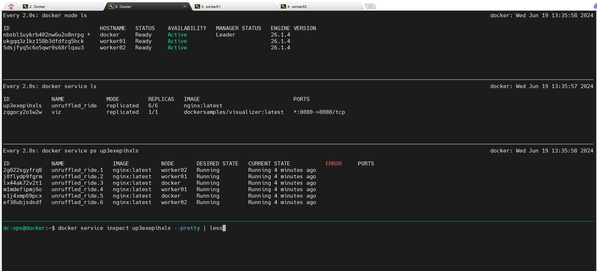
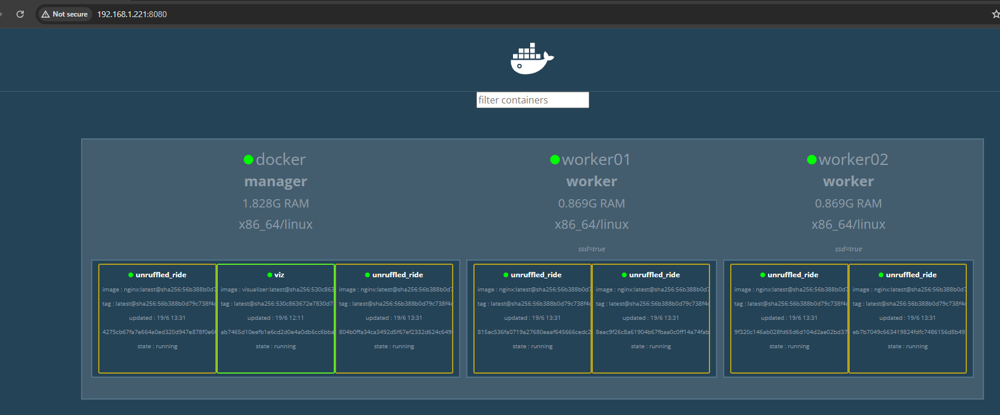

# Docker Swarm Service Create Option

[How services work](https://docs.docker.com/engine/swarm/how-swarm-mode-works/services)

[Runtime options with Memory, CPUs, and GPUs](https://docs.docker.com/config/containers/resource_constraints)

Syntax:

```docker service create [OPTIONS] IMAGE [COMMAND] [ARG...]```

> Options are:

>> How to take Help:

- For Resources: 
```bash
$ docker service create --help | grep resou

--generic-resource list              User defined resources
```

- For Reservation: 
```bash
$ docker service create --help | grep reser

--reserve-cpu decimal                Reserve CPUs
--reserve-memory bytes               Reserve Memory
```

- For Limit: 

```bash
$ docker service create --help | grep limit

--limit-cpu decimal                  Limit CPUs
--limit-memory bytes                 Limit Memory
--limit-pids int                     Limit maximum number of processes (default 0 = unlimited)
--replicas-max-per-node uint         Maximum number of tasks per node (default 0 = unlimited)
--ulimit ulimit                      Ulimit options (default [])
```
```bash
$ docker service create --help | grep update

      --update-delay duration              Delay between updates (ns|us|ms|s|m|h) (default 0s)
      --update-failure-action string       Action on update failure ("pause", "continue", "rollback") (default "pause")
      --update-max-failure-ratio float     Failure rate to tolerate during an update (default 0)
      --update-monitor duration            Duration after each task update to monitor for failure (ns|us|ms|s|m|h) (default 5s)
      --update-order string                Update order ("start-first", "stop-first") (default "stop-first")
      --update-parallelism uint            Maximum number of tasks updated simultaneously (0 to update all at once) (default 1)
```

Now, we will create a service and replicas would be 6

```bash
$ docker service create -d --replicas=6 nginx

up3exepihxlsltxh43rwl6i42
```

How it looks:


In visualizer, how it looks like:



