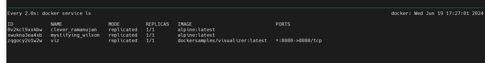
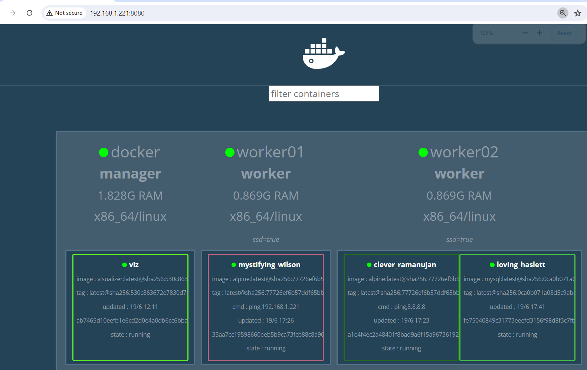

# Docker secrets

[Manage sensitive data with Docker secrets](https://docs.docker.com/engine/swarm/secrets/)


You can use secrets to manage any sensitive data which a container needs at runtime but you don't want to store in the image or in source control, such as:

- Usernames and passwords
- TLS certificates and keys
- SSH keys
- Other important data such as the name of a database or internal server
- Generic strings or binary content (up to 500 kb in size)

> To create a secret

```
$ docker secret create dbpass -
welcome2pass   # type password whatever your want.
r0oyevizjy4xzexzvjb2jvdy7
```
```enter``` and ```ctrl+d``` to save your password

To list out secret 
```bash
$ docker secret ls
ID                          NAME      DRIVER    CREATED         UPDATED
r0oyevizjy4xzexzvjb2jvdy7   dbpass              2 minutes ago   2 minutes ago
```

- You can inspect the secret to verify that the password is visible.

```bash
$ docker secret inspect dbpass
[
    {
        "ID": "r0oyevizjy4xzexzvjb2jvdy7",
        "Version": {
            "Index": 1650
        },
        "CreatedAt": "2024-06-19T07:10:50.285919617Z",
        "UpdatedAt": "2024-06-19T07:10:50.285919617Z",
        "Spec": {
            "Name": "dbpass",
            "Labels": {}
        }
    }
]
```

### Two way to create a secret, 
- First we already checked ```docker secret create dbpass -```

- second, will create a file and save the password 
```css
$ vi testpw
$ cat testpw
typepasswd
```
will supply the file during create the secret.
```bash
$ docker secret create mytestfile testpw
pxk4l0wppf6ym6cozj2e77kyu
```

You can list out the secret
```bash
$ docker secret ls
ID                          NAME         DRIVER    CREATED              UPDATED
r0oyevizjy4xzexzvjb2jvdy7   dbpass                 9 minutes ago        9 minutes ago
pxk4l0wppf6ym6cozj2e77kyu   mytestfile             About a minute ago   About a minute ago
$
```

# How to use it.

Demo Purpose.
> will create alpine service.

If we are not assigning any secrets, then we won't be able to access them after creation. Take a look.

If I don't supply the secret, then it won't get.

```bash
$ docker service create -d alpine ping 8.8.8.8
8v2kcl9xxkbwxr2urav9za8m5
```

Now, we will try to add secret during cration time.
```css
~$ docker service create -d --secret dbpass alpine ping 192.168.1.221
xwukna3ea4xbrgl3q41ljknvx
```


```bash
dc-ops@docker:~$ docker service ps xwukna3ea4xbrgl3q41ljknvx
ID             NAME                  IMAGE           NODE       DESIRED STATE   CURRENT STATE                ERROR     PORTS
ulqm1n37iumu   mystifying_wilson.1   alpine:latest   worker01   Running         Running about a minute ago
dc-ops@docker:~$
```

Now, you need to verify where it is running, i.e., which node; in my case, it is running on worker01, and I'll try to connect. You need to get the secret, then you need to go as below:.
```/run/secrets/<secretname>```

```bash
dc-ops@worker01:~$ docker container ls
CONTAINER ID   IMAGE           COMMAND                CREATED         STATUS         PORTS     NAMES
33aa7cc19598   alpine:latest   "ping 192.168.1.221"   6 minutes ago   Up 6 minutes             mystifying_wilson.1.ulqm1n37iumu1vwaddsshnt8i

```
```bash
dc-ops@worker01:~$ docker container exec -it 33aa7cc19598 sh
/ # cd /run
/run # ls
secrets
/run # cd secrets/
/run/secrets # ls
dbpass
/run/secrets # cat dbpass
welcome2pass
/run/secrets #
```

### usecase: we will create a databse container and will use secret overthere. Take a look.

```bash
$ docker secret ls
ID                          NAME         DRIVER    CREATED          UPDATED
r0oyevizjy4xzexzvjb2jvdy7   dbpass                 27 minutes ago   27 minutes ago
pxk4l0wppf6ym6cozj2e77kyu   mytestfile             18 minutes ago   18 minutes ago
```

> Now, creating mysql container with secret ```--secret <secret-name>```

```bash
$ docker service create -d --secret dbpass -e MYSQL_ROOT_PASSWORD_FILE=/run/secrets/dbpass mysql
q2oq5dd2pejrc64uozz9tcm4w
```
```bash
docker service ls
ID             NAME                MODE         REPLICAS   IMAGE                             PORTS
8v2kcl9xxkbw   clever_ramanujan    replicated   1/1        alpine:latest
q2oq5dd2pejr   loving_haslett      replicated   1/1        mysql:latest
xwukna3ea4xb   mystifying_wilson   replicated   1/1        alpine:latest
zqgocy2o1w2w   viz                 replicated   1/1        dockersamples/visualizer:latest   *:8080->8080/tcp
```
> Now, we will see where it is running and have noticed it is running on worker02. We can also use visualizer if you want to know which container is running on which worker.



```bash
$ docker service ps q2oq5dd2pejr
ID             NAME               IMAGE          NODE       DESIRED STATE   CURRENT STATE            ERROR     PORTS
ul1cqtkb44wu   loving_haslett.1   mysql:latest   worker02   Running         Running 18 seconds ago
```

> Now, I am in ```worker02```
```bash
dc-ops@worker02:~$ docker container ls
CONTAINER ID   IMAGE           COMMAND                  CREATED          STATUS          PORTS                 NAMES
fe75040849c3   mysql:latest    "docker-entrypoint.s…"   4 minutes ago    Up 4 minutes    3306/tcp, 33060/tcp   loving_haslett.1.ul1cqtkb44wueqx4yyoqfjlf9
a1e4f4ec2a48   alpine:latest   "ping 8.8.8.8"           22 minutes ago   Up 22 minutes                         clever_ramanujan.1.4uzwpgdu4rbv72spb1ufp5elo
```

Now, we will try to access the container first and try to access database.
```bash
dc-ops@worker02:~$ docker container exec -it fe75040849c3 /bin/bash
bash-5.1# cat /run/secrets/dbpass
welcome2pass

bash-5.1# mysql -u root -pasdfwefsdafa   # I have given wrong password to verify that it is accepting wrong password or not.
mysql: [Warning] Using a password on the command line interface can be insecure.
ERROR 1045 (28000): Access denied for user 'root'@'localhost' (using password: YES)

# Now, try to give correct password and it works.

bash-5.1# mysql -u root -pwelcome2pass
mysql: [Warning] Using a password on the command line interface can be insecure.
Welcome to the MySQL monitor.  Commands end with ; or \g.
Your MySQL connection id is 13
Server version: 8.4.0 MySQL Community Server - GPL

Copyright (c) 2000, 2024, Oracle and/or its affiliates.

Oracle is a registered trademark of Oracle Corporation and/or its
affiliates. Other names may be trademarks of their respective
owners.

Type 'help;' or '\h' for help. Type '\c' to clear the current input statement.

mysql>
```

