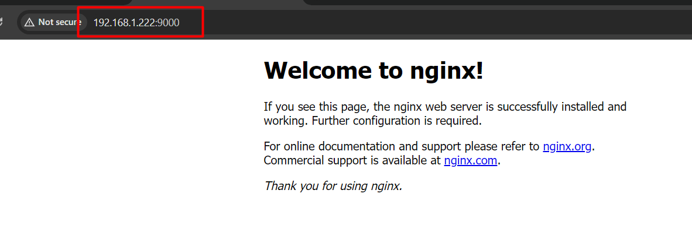

# Docker Swarm Overlay Network

> [Networking with overlay networks](https://docs.docker.com/network/>network-tutorial-overlay/)
>> [Networking overview](https://docs.docker.com/network/)

In a Docker Swarm environment, ```two distinct``` types of traffic are generated:

- ```Control and Management Plane Traffic```: This encompasses swarm management messages, such as requests to join or leave the swarm. This type of traffic is always encrypted to ensure security.
- ```Application Data Plane Traffic```: This includes container traffic and interactions with external clients.

Three key network concepts are integral to swarm services:

- ```Overlay Networks```: These networks manage communications among the Docker daemons participating in the swarm. Overlay networks can be created similarly to user-defined networks for standalone containers and utilize the overlay network driver.
- ```Ingress Network```: This is a specialized overlay network that enables load balancing among a service's nodes. When any swarm node receives a request on a published port, it delegates the request to a module called IPVS (IP Virtual Server). IPVS maintains a record of all IP addresses involved in the service, selects one, and routes the request to it via the ingress network.
- ```docker_gwbridge```: This bridge network links the overlay networks (including the ingress network) to an individual Docker daemon's physical network. By default, each running container service connects to its local Docker daemon host's docker_gwbridge network.
Understanding these network concepts is crucial for effectively managing and deploying services within a Docker Swarm.

*When you install the swarm then ingress network is created bydefault.*

```bash
$ docker network ls
NETWORK ID     NAME                     DRIVER    SCOPE
a4009f06e440   06env-variable_default   bridge    local
b06e3cea66d7   bridge                   bridge    local
9e81df4352d6   docker_gwbridge          bridge    local   # if would be auto-attach to all of the container where overlay network will attach.  
4579f5d18bba   host                     host      local
n2kslakcvzkr   ingress                  overlay   swarm   # by default network
b440bc1b1c46   none                     null      local
```
#### How to create overlay network
```docker network create -d overlay <NameNewtork>```

```bash
$ docker network create -d overlay test
up9sgv2t9b2btxfx2eom2qcpu

$ docker network ls
NETWORK ID     NAME                     DRIVER    SCOPE
a4009f06e440   06env-variable_default   bridge    local
b06e3cea66d7   bridge                   bridge    local
9e81df4352d6   docker_gwbridge          bridge    local
4579f5d18bba   host                     host      local
n2kslakcvzkr   ingress                  overlay   swarm
b440bc1b1c46   none                     null      local
up9sgv2t9b2b   test                     overlay   swarm   # newly created newtork
```
- This test network would be available to all workers as well because it's an overlay network.

*From Worker01*
```bash
dc-ops@worker01:~$ docker network ls
NETWORK ID     NAME              DRIVER    SCOPE
9efaa354a147   bridge            bridge    local
da3ea0d447a5   docker_gwbridge   bridge    local
9f7ed8af0b74   host              host      local
n2kslakcvzkr   ingress           overlay   swarm
3eabba9b0b64   none              null      local
up9sgv2t9b2b   test              overlay   swarm  # newly created network
dc-ops@worker01:~$
```
*From Worker02*
```bash
dc-ops@worker02:~$ docker network ls
NETWORK ID     NAME              DRIVER    SCOPE
2345abfac39f   bridge            bridge    local
ae39ab8d4a10   docker_gwbridge   bridge    local
bcc120c99950   host              host      local
n2kslakcvzkr   ingress           overlay   swarm
d12e5a7cb8bb   none              null      local
up9sgv2t9b2b   test              overlay   swarm   # newly created network
```

- We are creating a service from Gaurav Sharma repos (*coolgourav147/sleeper_traceroute*).

```bash
$ docker service create -d --network test coolgourav147/sleeper_traceroute
vwyu2ptyoh7ap6vt3yvzshq1z
```

```bash
$ docker service create -d --network test coolgourav147/sleeper_traceroute
vwyu2ptyoh7ap6vt3yvzshq1z
$ docker service ls
ID             NAME           MODE         REPLICAS   IMAGE                                     PORTS
vwyu2ptyoh7a   funny_easley   replicated   1/1        coolgourav147/sleeper_traceroute:latest
zqgocy2o1w2w   viz            replicated   1/1        dockersamples/visualizer:latest           *:8080->8080/tcp
$ docker service ps vwyu2ptyoh7a
ID             NAME             IMAGE                                     NODE       DESIRED STATE   CURRENT STATE                ERROR     PORTS
pfx5vu7c2quu   funny_easley.1   coolgourav147/sleeper_traceroute:latest   worker02   Running         Running about a minute ago
$ docker service inspect vwyu2ptyoh7a --pretty

ID:             vwyu2ptyoh7ap6vt3yvzshq1z
Name:           funny_easley
Service Mode:   Replicated
 Replicas:      1
Placement:
UpdateConfig:
 Parallelism:   1
 On failure:    pause
 Monitoring Period: 5s
 Max failure ratio: 0
 Update order:      stop-first
RollbackConfig:
 Parallelism:   1
 On failure:    pause
 Monitoring Period: 5s
 Max failure ratio: 0
 Rollback order:    stop-first
ContainerSpec:
 Image:         coolgourav147/sleeper_traceroute:latest@sha256:9c8300ab567edf5fc10f36a527044fadbc1a1956e8d9a6259f83ebe76e116219
 Init:          false
Resources:
Networks: test
Endpoint Mode:  vip

$
```

- will create a 3 replica for the same service.
```css
$ docker service scale vwyu2ptyoh7ap6vt3yvzshq1z=3
vwyu2ptyoh7ap6vt3yvzshq1z scaled to 3
overall progress: 3 out of 3 tasks
1/3: running   [==================================================>]
2/3: running   [==================================================>]
3/3: running   [==================================================>]
verify: Service vwyu2ptyoh7ap6vt3yvzshq1z converged
$
```


- *By default, overlay networks can't be attached to containers. Let's have a look. We are trying to create a container from worker02 and will get the below error message.

```bash
dc-ops@worker02:~$ docker container run -d --network=test coolgourav147/sleeper_traceroute
Unable to find image 'coolgourav147/sleeper_traceroute:latest' locally
latest: Pulling from coolgourav147/sleeper_traceroute
Digest: sha256:9c8300ab567edf5fc10f36a527044fadbc1a1956e8d9a6259f83ebe76e116219
Status: Downloaded newer image for coolgourav147/sleeper_traceroute:latest
d68b9a13a8d4740e82245fb4b55578829d5dee1ee8855354180c575da7c26ff5
docker: Error response from daemon: Could not attach to network test: rpc error: code = PermissionDenied desc = network test not manually attachable.
dc-ops@worker02:~$
```
- *If you want to attach that network to a container, then you have to follow the steps below:

*On master node:*
```bash
$ docker network create -d overlay --attachable test01
btlfrbq2l6957s00py7ksmb3c
$
```
*On worker02, will try to create a container with new network and it works.*
```bash
dc-ops@worker02:~$ docker container run -d --network=test01 coolgourav147/sleeper_traceroute
7e53a7d905992a1372b4b6f483a2866d4cb3ca0940e33d2e48d9d18175ba8dd9
dc-ops@worker02:~$

dc-ops@worker02:~$ docker container ls -a
CONTAINER ID   IMAGE                                     COMMAND        CREATED              STATUS              PORTS     NAMES
7e53a7d90599   coolgourav147/sleeper_traceroute          "sleep 3600"   About a minute ago   Up About a minute             clever_sammet
d68b9a13a8d4   coolgourav147/sleeper_traceroute          "sleep 3600"   4 minutes ago        Created                       stupefied_goldstine
28beccc26b5c   coolgourav147/sleeper_traceroute:latest   "sleep 3600"   14 minutes ago       Up 14 minutes                 funny_easley.1.pfx5vu7c2quuu3mv2ga47l88t
dc-ops@worker02:~$

```
*On worker01, will try to create a container with new network and it works.*
```bash
dc-ops@worker01:~$ docker container run -d --network=test01 coolgourav147/sleeper_traceroute

Unable to find image 'coolgourav147/sleeper_traceroute:latest' locally
latest: Pulling from coolgourav147/sleeper_traceroute
Digest: sha256:9c8300ab567edf5fc10f36a527044fadbc1a1956e8d9a6259f83ebe76e116219
Status: Downloaded newer image for coolgourav147/sleeper_traceroute:latest
c841054f0e60cd3339816602090cbfe8f82d96cbd9d93c82d18e471709c4a94e

dc-ops@worker01:~$ docker container ls -a
CONTAINER ID   IMAGE                                     COMMAND        CREATED          STATUS          PORTS     NAMES
c841054f0e60   coolgourav147/sleeper_traceroute          "sleep 3600"   26 seconds ago   Up 21 seconds             hungry_wescoff
1cab4357319a   coolgourav147/sleeper_traceroute:latest   "sleep 3600"   11 minutes ago   Up 11 minutes             funny_easley.2.z678yqfqloukryu81tuyqy3bd
dc-ops@worker01:~$
```

```bash
$ docker network ls
NETWORK ID     NAME                     DRIVER    SCOPE
a4009f06e440   06env-variable_default   bridge    local
b06e3cea66d7   bridge                   bridge    local
9e81df4352d6   docker_gwbridge          bridge    local   # will inspect this one
4579f5d18bba   host                     host      local
n2kslakcvzkr   ingress                  overlay   swarm
b440bc1b1c46   none                     null      local
up9sgv2t9b2b   test                     overlay   swarm
btlfrbq2l695   test01                   overlay   swarm    # will inspect this one
```
- Will inspect the network
```bash
$ docker network inspect 9e81df4352d6
[
    {
        "Name": "docker_gwbridge",
        "Id": "9e81df4352d6ea02e2a8206e4dbdede124d63c5c4616b28aae53790d256ea901",
        "Created": "2024-06-16T17:56:32.107139222+10:00",
        "Scope": "local",
        "Driver": "bridge",
        "EnableIPv6": false,
        "IPAM": {
            "Driver": "default",
            "Options": null,
            "Config": [
                {
                    "Subnet": "172.19.0.0/16",
                    "Gateway": "172.19.0.1"
                }
            ]
        },
        "Internal": false,
        "Attachable": false,
        "Ingress": false,
        "ConfigFrom": {
            "Network": ""
        },
        "ConfigOnly": false,
        "Containers": {
            "4c357128b662e59ac3dd3cfdbccb00116e7f2938a3343a5f3b78897441d4f2cd": {
                "Name": "gateway_5a12ea1b3b13",
                "EndpointID": "1b1b94b07414bf7fff749c4b39039865ef0ebc362fd9ac9aeb915267e5e02b3b",
                "MacAddress": "02:42:ac:13:00:04",
                "IPv4Address": "172.19.0.4/16",
                "IPv6Address": ""
            },
            "876534c6aa68f219f708cad0b5a55cfab345a625c29efcd8123002c542ecfbdd": {
                "Name": "gateway_22d01612d077",
                "EndpointID": "f9134f74a3fc3606d4b17f6c80e316fc3ad043c472c11e076f56f9c3e5274f1a",
                "MacAddress": "02:42:ac:13:00:03",
                "IPv4Address": "172.19.0.3/16",
                "IPv6Address": ""
            },
            "ingress-sbox": {
                "Name": "gateway_ingress-sbox",
                "EndpointID": "a92d44d8419bca5aed1a7d2db5601f1eb60b4903627f39deac0855c3e85bb067",
                "MacAddress": "02:42:ac:13:00:02",
                "IPv4Address": "172.19.0.2/16",
                "IPv6Address": ""
            }
        },
        "Options": {
            "com.docker.network.bridge.enable_icc": "false",
            "com.docker.network.bridge.enable_ip_masquerade": "true",
            "com.docker.network.bridge.name": "docker_gwbridge"
        },
        "Labels": {}
    }
]

$ docker network inspect btlfrbq2l695
[
    {
        "Name": "test01",
        "Id": "btlfrbq2l6957s00py7ksmb3c",
        "Created": "2024-06-20T01:33:40.385632425Z",
        "Scope": "swarm",
        "Driver": "overlay",
        "EnableIPv6": false,
        "IPAM": {
            "Driver": "default",
            "Options": null,
            "Config": [
                {
                    "Subnet": "10.0.2.0/24",
                    "Gateway": "10.0.2.1"
                }
            ]
        },
        "Internal": false,
        "Attachable": true,
        "Ingress": false,
        "ConfigFrom": {
            "Network": ""
        },
        "ConfigOnly": false,
        "Containers": null,
        "Options": {
            "com.docker.network.driver.overlay.vxlanid_list": "4098"
        },
        "Labels": null
    }
]
$

```

IP details from ```worker02``` for container which we have created recently.

```bash
dc-ops@worker02:~$ docker container ls -a
CONTAINER ID   IMAGE                                     COMMAND        CREATED          STATUS          PORTS     NAMES
7e53a7d90599   coolgourav147/sleeper_traceroute          "sleep 3600"   7 minutes ago    Up 7 minutes              clever_sammet
d68b9a13a8d4   coolgourav147/sleeper_traceroute          "sleep 3600"   10 minutes ago   Created                   stupefied_goldstine
28beccc26b5c   coolgourav147/sleeper_traceroute:latest   "sleep 3600"   21 minutes ago   Up 21 minutes             funny_easley.1.pfx5vu7c2quuu3mv2ga47l88t
dc-ops@worker02:~$ docker container exec -it 7e53a7d90599 bash
root@7e53a7d90599:/# ifconfig
eth0      Link encap:Ethernet  HWaddr 02:42:0a:00:02:02
          inet addr:10.0.2.2  Bcast:10.0.2.255  Mask:255.255.255.0  # get from network "test01"
          UP BROADCAST RUNNING MULTICAST  MTU:1450  Metric:1
          RX packets:0 errors:0 dropped:0 overruns:0 frame:0
          TX packets:0 errors:0 dropped:0 overruns:0 carrier:0
          collisions:0 txqueuelen:0
          RX bytes:0 (0.0 B)  TX bytes:0 (0.0 B)

eth1      Link encap:Ethernet  HWaddr 02:42:ac:12:00:04
          inet addr:172.18.0.4  Bcast:172.18.255.255  Mask:255.255.0.0 # get from docker_gwbridge
          UP BROADCAST RUNNING MULTICAST  MTU:1500  Metric:1
          RX packets:29 errors:0 dropped:0 overruns:0 frame:0
          TX packets:0 errors:0 dropped:0 overruns:0 carrier:0
          collisions:0 txqueuelen:0
          RX bytes:3347 (3.3 KB)  TX bytes:0 (0.0 B)

lo        Link encap:Local Loopback
          inet addr:127.0.0.1  Mask:255.0.0.0
          inet6 addr: ::1/128 Scope:Host
          UP LOOPBACK RUNNING  MTU:65536  Metric:1
          RX packets:0 errors:0 dropped:0 overruns:0 frame:0
          TX packets:0 errors:0 dropped:0 overruns:0 carrier:0
          collisions:0 txqueuelen:1000
          RX bytes:0 (0.0 B)  TX bytes:0 (0.0 B)

root@7e53a7d90599:/#
```

IP details from ```worker01``` for the container that we created recently.

```bash
dc-ops@worker01:~$ docker container ls -a
CONTAINER ID   IMAGE                                     COMMAND        CREATED          STATUS          PORTS     NAMES
c841054f0e60   coolgourav147/sleeper_traceroute          "sleep 3600"   9 minutes ago    Up 8 minutes              hungry_wescoff
1cab4357319a   coolgourav147/sleeper_traceroute:latest   "sleep 3600"   19 minutes ago   Up 19 minutes             funny_easley.2.z678yqfqloukryu81tuyqy3bd


dc-ops@worker01:~$ docker container exec -it c841054f0e60 bash
root@c841054f0e60:/# ifconfig
eth0      Link encap:Ethernet  HWaddr 02:42:0a:00:02:04
          inet addr:10.0.2.4  Bcast:10.0.2.255  Mask:255.255.255.0 # get from network "test01"
          UP BROADCAST RUNNING MULTICAST  MTU:1450  Metric:1
          RX packets:0 errors:0 dropped:0 overruns:0 frame:0
          TX packets:0 errors:0 dropped:0 overruns:0 carrier:0
          collisions:0 txqueuelen:0
          RX bytes:0 (0.0 B)  TX bytes:0 (0.0 B)

eth1      Link encap:Ethernet  HWaddr 02:42:ac:12:00:04
          inet addr:172.18.0.4  Bcast:172.18.255.255  Mask:255.255.0.0 # get from docker_gwbridge
          UP BROADCAST RUNNING MULTICAST  MTU:1500  Metric:1
          RX packets:31 errors:0 dropped:0 overruns:0 frame:0
          TX packets:0 errors:0 dropped:0 overruns:0 carrier:0
          collisions:0 txqueuelen:0
          RX bytes:3524 (3.5 KB)  TX bytes:0 (0.0 B)

lo        Link encap:Local Loopback
          inet addr:127.0.0.1  Mask:255.0.0.0
          inet6 addr: ::1/128 Scope:Host
          UP LOOPBACK RUNNING  MTU:65536  Metric:1
          RX packets:0 errors:0 dropped:0 overruns:0 frame:0
          TX packets:0 errors:0 dropped:0 overruns:0 carrier:0
          collisions:0 txqueuelen:1000
          RX bytes:0 (0.0 B)  TX bytes:0 (0.0 B)
root@c841054f0e60:/#

# You can ping container which is created on worker02 via overlay network.
root@c841054f0e60:/# ping 10.0.2.2
PING 10.0.2.2 (10.0.2.2) 56(84) bytes of data.
64 bytes from 10.0.2.2: icmp_seq=1 ttl=64 time=3.17 ms
64 bytes from 10.0.2.2: icmp_seq=2 ttl=64 time=3.04 ms
64 bytes from 10.0.2.2: icmp_seq=3 ttl=64 time=3.17 ms
64 bytes from 10.0.2.2: icmp_seq=4 ttl=64 time=3.04 ms
64 bytes from 10.0.2.2: icmp_seq=5 ttl=64 time=2.59 ms
64 bytes from 10.0.2.2: icmp_seq=6 ttl=64 time=2.86 ms
```

## Ingresh routing

*will delete all container & services which we have created in above task.*

will create a nginx container and will see the outcomes
```bash
$ docker service ls
ID             NAME      MODE         REPLICAS   IMAGE                             PORTS
zqgocy2o1w2w   viz       replicated   1/1        dockersamples/visualizer:latest   *:8080->8080/tcp
$ docker service create -d --replicas 2 -p 9000:80 nginx
yvjn62jq0txwuk8gq247xjy9l
$
```


In visualizer, how it looks like:


As you can see, two containers are created on workers 01 and 02, but Nginx would be accessible from Docker because of the Overley network. Take a look.

Host details: 
```css
docker: 192.168.1.221
worker01: 192.168.1.222
worker02: 192.168.1.223

```
*from master (docker)*


*from worker01*


*from worker02*


> Now, we will change the index file from both container to double verify that LB is working fine.

*from ```worker01```*
 will select the container and change the index file as below-
 ```/usr/share/nginx/html```

```bash
dc-ops@worker01:~$ docker container ls -a
CONTAINER ID   IMAGE          COMMAND                  CREATED         STATUS         PORTS     NAMES
425489be0c7e   nginx:latest   "/docker-entrypoint.…"   8 minutes ago   Up 8 minutes   80/tcp    happy_elion.1.pghcusllmyxjqy8vc5hgfpyqr
dc-ops@worker01:~$ docker container exec -it 4254 /bin/bash

root@425489be0c7e:/# ls
bin  boot  dev  docker-entrypoint.d  docker-entrypoint.sh  etc  home  lib  lib64  media  mnt  opt  proc  root  run  sbin  srv  sys  tmp  usr  var

root@425489be0c7e:/# cd /usr/share/nginx/
root@425489be0c7e:/usr/share/nginx# ls
html
root@425489be0c7e:/usr/share/nginx# cd html/
root@425489be0c7e:/usr/share/nginx/html# ls
50x.html  index.html

root@425489be0c7e:/usr/share/nginx/html# cat index.html
<!DOCTYPE html>
<html>
<head>
<title>Welcome to nginx!</title>
<style>
html { color-scheme: light dark; }
body { width: 35em; margin: 0 auto;
font-family: Tahoma, Verdana, Arial, sans-serif; }
</style>
</head>
<body>
<h1>Welcome to nginx!</h1>
<p>If you see this page, the nginx web server is successfully installed and
working. Further configuration is required.</p>

<p>For online documentation and support please refer to
<a href="http://nginx.org/">nginx.org</a>.<br/>
Commercial support is available at
<a href="http://nginx.com/">nginx.com</a>.</p>

<p><em>Thank you for using nginx.</em></p>
</body>
</html>


root@425489be0c7e:/usr/share/nginx/html# echo "this page from worker01" > index.html
root@425489be0c7e:/usr/share/nginx/html# pwd
/usr/share/nginx/html
root@425489be0c7e:/usr/share/nginx/html#
```

*from ```worker02```*
 will select the container and change the index file as below-
 ```/usr/share/nginx/html```

 ```bash
 dc-ops@worker02:~$ docker container ls -a
CONTAINER ID   IMAGE          COMMAND                  CREATED          STATUS          PORTS     NAMES
51b0a3ed3de0   nginx:latest   "/docker-entrypoint.…"   11 minutes ago   Up 11 minutes   80/tcp    happy_elion.2.c8hlvgjkqyzhcxaqn2hcrypr8

dc-ops@worker02:~$ docker container exec -it 51b0a3ed3de0 /bin/bash

root@51b0a3ed3de0:/# cd /usr/share/nginx/html/

root@51b0a3ed3de0:/usr/share/nginx/html# ls
50x.html  index.html
root@51b0a3ed3de0:/usr/share/nginx/html# echo "this page from worker02" > index.html
root@51b0a3ed3de0:/usr/share/nginx/html#
 ```

Now, try to access the page from all three nodes, and you will see the references.


__**Keep In Mind:__*- When we create a container and publish the port on the container, by default it attaches to the ingress network.

example:
```bash
$ docker service create -d --network test --replicas 2 -p 9000:80 coolgourav147/sleeper_traceroute
98r3j7cgpq5xmwxwpahd67er2
```
It will create three network, ```first```: for custom network which is ```test``` and ```second``` is ```overley```.