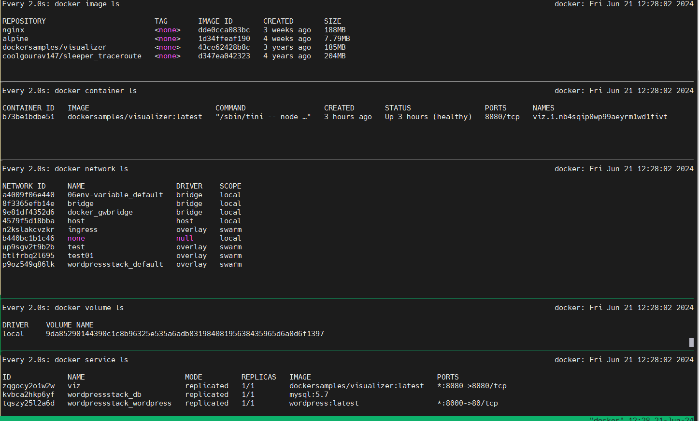

[Docker Stack](https://docs.docker.com/reference/cli/docker/stack/)

Help

```yml
$ docker stack --help

Usage:  docker stack COMMAND

Manage Swarm stacks

Commands:
  config      Outputs the final config file, after doing merges and interpolations
  deploy      Deploy a new stack or update an existing stack
  ls          List stacks
  ps          List the tasks in the stack
  rm          Remove one or more stacks
  services    List the services in the stack
```

To deploy this file, use below command -
```bash
$docker stack deploy - c [filename] [stackname]
```
```yml
$ docker stack deploy -c docker-compose.yaml wordpressstack
Ignoring unsupported options: restart

Since --detach=false was not specified, tasks will be created in the background.
In a future release, --detach=false will become the default.
Creating network wordpressstack_default
Creating service wordpressstack_db
Creating service wordpressstack_wordpress
```

```yml
$ docker service ls
ID             NAME                       MODE         REPLICAS   IMAGE                             PORTS
zqgocy2o1w2w   viz                        replicated   1/1        dockersamples/visualizer:latest   *:8080->8080/tcp
kvbca2hkp6yf   wordpressstack_db          replicated   1/1        mysql:5.7
tqszy25l2a6d   wordpressstack_wordpress   replicated   0/1        wordpress:latest                  *:8000->80/tcp
```




```yml
$ docker stack ls
NAME             SERVICES
wordpressstack   2

$ docker stack ps wordpressstack
ID             NAME                         IMAGE              NODE       DESIRED STATE   CURRENT STATE           ERROR     PORTS
u5p42cslqn8l   wordpressstack_db.1          mysql:5.7          worker02   Running         Running 4 minutes ago
pkpdbe7xltu4   wordpressstack_wordpress.1   wordpress:latest   worker01   Running         Running 3 minutes ago
$
```

```yml
$ docker stack services wordpressstack
ID             NAME                       MODE         REPLICAS   IMAGE              PORTS
kvbca2hkp6yf   wordpressstack_db          replicated   1/1        mysql:5.7
tqszy25l2a6d   wordpressstack_wordpress   replicated   1/1        wordpress:latest   *:8000->80/tcp

$ docker service ls
ID             NAME                       MODE         REPLICAS   IMAGE                             PORTS
zqgocy2o1w2w   viz                        replicated   1/1        dockersamples/visualizer:latest   *:8080->8080/tcp
kvbca2hkp6yf   wordpressstack_db          replicated   1/1        mysql:5.7
tqszy25l2a6d   wordpressstack_wordpress   replicated   1/1        wordpress:latest                  *:8000->80/tcp
```
* what's the difference between docker service and docker stack service?

Docker service: shows all services
```
$ docker service ls
ID             NAME                       MODE         REPLICAS   IMAGE                             PORTS
ajfevd5zs8sg   modest_hopper              replicated   1/1        ubuntu:14.04
zqgocy2o1w2w   viz                        replicated   1/1        dockersamples/visualizer:latest   *:8080->8080/tcp
kvbca2hkp6yf   wordpressstack_db          replicated   1/1        mysql:5.7
tqszy25l2a6d   wordpressstack_wordpress   replicated   1/1        wordpress:latest                  *:8000->80/tcp
```
Docker stack service: shows only stack services
```
$ docker stack services wordpressstack
ID             NAME                       MODE         REPLICAS   IMAGE              PORTS
kvbca2hkp6yf   wordpressstack_db          replicated   1/1        mysql:5.7
tqszy25l2a6d   wordpressstack_wordpress   replicated   1/1        wordpress:latest   *:8000->80/tcp
```
#### To remove the stack
```docker stack rm <stackname>```
```yml
$ docker stack rm wordpressstack

Removing service wordpressstack_db
Removing service wordpressstack_wordpress
Removing network wordpressstack_default
```


