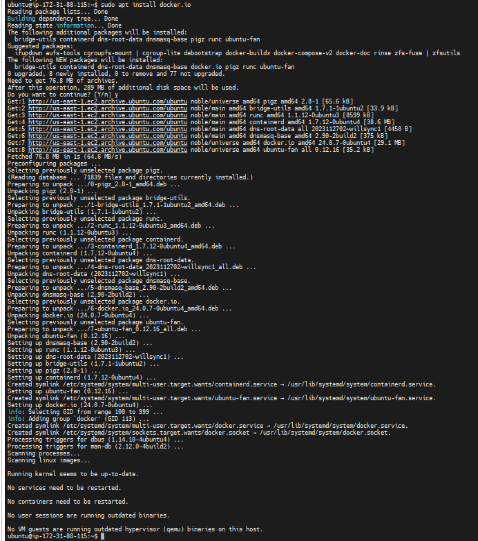

# Kubeadm Installation Guide for 2 tier application

--------
Lab Setup:

```powershell
master : 192.168.1.101
worker : 192.168.1.102
OS Details: Ubuntu 24.04 LTS
```
--------

### Will run the following code on "Master" & "Worker" Node

```yaml

# Update the package first
sudo apt-get update -y

# Install docker
sudo apt-get install docker.io -y
sudo usermod -aG docker $USER
sudo systemctl enable docker  # enable and start in single command

# Add Kubernetes APT repository and install required packages

sudo apt-get update -y
sudo apt-get install -y apt-transport-https ca-certificates curl gpg
curl -fsSL https://pkgs.k8s.io/core:/stable:/v1.30/deb/Release.key | sudo gpg --dearmor -o /etc/apt/keyrings/kubernetes-apt-keyring.gpg
# This overwrites any existing configuration in /etc/apt/sources.list.d/kubernetes.list
echo 'deb [signed-by=/etc/apt/keyrings/kubernetes-apt-keyring.gpg] https://pkgs.k8s.io/core:/stable:/v1.30/deb/ /' | sudo tee /etc/apt/sources.list.d/kubernetes.list

# Install Kubernetes
sudo apt-get update -y
sudo apt-get install kubeadm kubelet kubectl -y
sudo apt-mark hold kubeadm kubelet kubectl

# disable swap
sudo swapoff -a
```
- Will validate the vesion
```bash
kubeadm version
```
-----
#### Following code should be run only on "```Master Node```"


```bash
sudo kubeadm config images pull

sudo kubeadm init

mkdir -p "$HOME"/.kube
sudo cp -i /etc/kubernetes/admin.conf "$HOME"/.kube/config
sudo chown "$(id -u)":"$(id -g)" "$HOME"/.kube/config

# Network Plugin = calico
kubectl apply -f https://raw.githubusercontent.com/projectcalico/calico/v3.26.0/manifests/calico.yaml

sudo systemctl enable --now kubelet
sudo systemctl start kubelet

kubeadm token create --print-join-command
```
------

#### Run it on the Client node only:

- Perform pre-flight checks
```bash
sudo kubeadm reset pre-flight checks
```
- Paste the join command you got from the master node and append ```--v=5``` at the end.
```bash
sudo your-token --v=5
sudo kubeadm join <master-ip>:6443 --token <token> --discovery-token-ca-cert-hash sha256:<hash>
```
```css
$ sudo kubeadm join 172.31.49.46:6443 --token gxd09z.wg682jdial5h57lr --discovery-token-ca-cert-hash sha256:a831854669c32ec8cdd4d4146a8922c602bb2753f52acd3072a453def1f081c2 --v=5
```

#### Verify the Cluster
On the master node, verify that the worker node has joined the cluster:
```sh
kubectl get nodes
```
You should see both the master and worker nodes listed and in the Ready state.

``` Obtaining machine-readable output:``` kubectl get can output JSON, YAML, or be directly formatted

Give us more info about the nodes: ```kubectl get nodes -o wide``` or YAML format:  ```kubectl get no -o yaml```

```bash
Troubleshooting Tips : Ensure both servers can communicate over the necessary ports:

6443 (API server)
2379-2380 (etcd)
10250 (kubelet)
10251 (kube-scheduler)
10252 (kube-controller-manager)
```
Current Cluster status:


----------------------------------------
[Source Code:](https://github.com/mrbalraj007/two-tier-flask-app)

Will clone from this repo: https://github.com/mrbalraj007/two-tier-flask-app.git


Now, we will deploy the pod and playaround:

- change the directory to ``` cd two-tier-flask-app/``` and go to "```k8s```"


