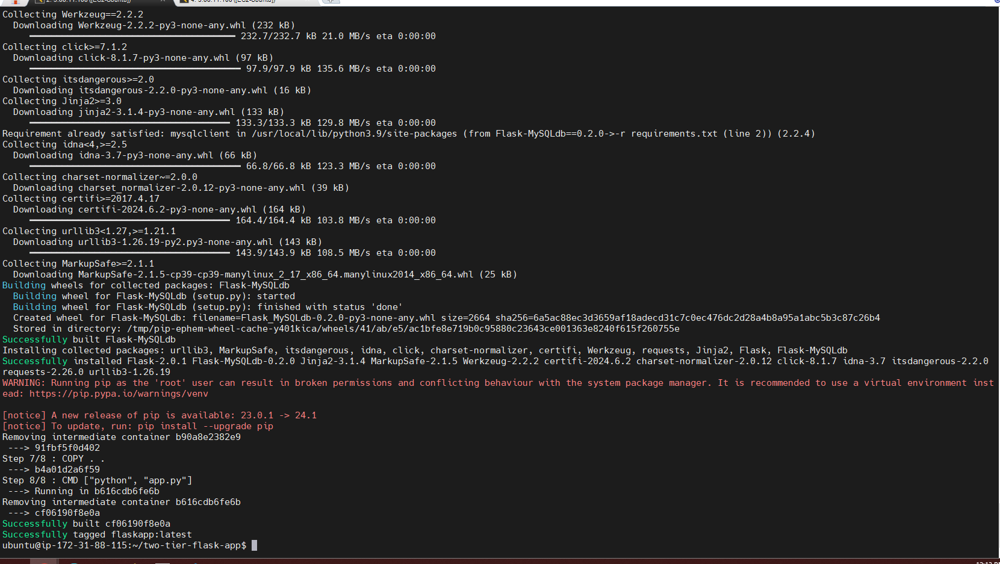
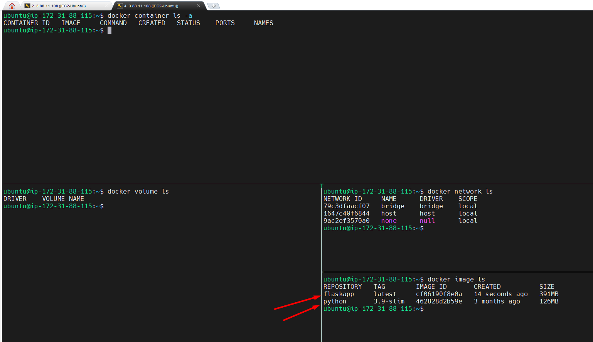
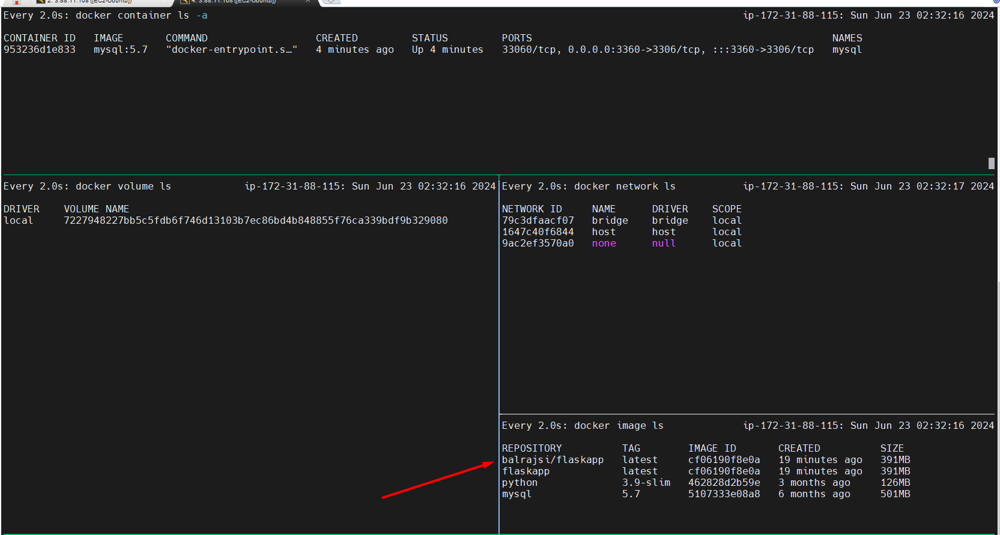

# 2-Tier Application Deployment
```bash
$ sudo apt update
```
```bash
$ sudo apt install docker.io
```


$ docker ps
permission denied while trying to connect to the Docker daemon socket at unix:///var/run/docker.sock: Get "http://%2Fvar%2Frun%2Fdocker.sock/v1.24/containers/json": dial unix /var/run/docker.sock: connect: permission denied
ubuntu@ip-172-31-88-115:~$

when you will do the docker ps, you may get the following error message because, you haven't set permission for user.

```bash
$ whoami
ubuntu

ubuntu@ip-172-31-88-115:~$ sudo chown ubuntu /var/run/docker.sock

or

sudo chown $USER /var/run/docker.sock
ubuntu@ip-172-31-88-115:~$
```

```bash
$ git clone https://github.com/mrbalraj007/two-tier-flask-app.git

Cloning into 'two-tier-flask-app'...
remote: Enumerating objects: 156, done.
remote: Counting objects: 100% (88/88), done.
remote: Compressing objects: 100% (47/47), done.
remote: Total 156 (delta 68), reused 41 (delta 41), pack-reused 68
Receiving objects: 100% (156/156), 41.14 KiB | 4.57 MiB/s, done.
Resolving deltas: 100% (76/76), done.
ubuntu@ip-172-31-88-115:~$ ls -l
total 4
drwxrwxr-x 6 ubuntu ubuntu 4096 Jun 23 02:06 two-tier-flask-app


ubuntu@ip-172-31-88-115:~$ cd two-tier-flask-app/
ubuntu@ip-172-31-88-115:~/two-tier-flask-app$ ls -l
total 44
-rw-rw-r-- 1 ubuntu ubuntu  628 Jun 23 02:06 Dockerfile
-rw-rw-r-- 1 ubuntu ubuntu  962 Jun 23 02:06 Jenkinsfile
-rw-rw-r-- 1 ubuntu ubuntu  880 Jun 23 02:06 Makefile
-rw-rw-r-- 1 ubuntu ubuntu 3169 Jun 23 02:06 README.md
-rw-rw-r-- 1 ubuntu ubuntu 1112 Jun 23 02:06 app.py
-rw-rw-r-- 1 ubuntu ubuntu  717 Jun 23 02:06 docker-compose.yml
drwxrwxr-x 2 ubuntu ubuntu 4096 Jun 23 02:06 eks-manifests
drwxrwxr-x 2 ubuntu ubuntu 4096 Jun 23 02:06 k8s
-rw-rw-r-- 1 ubuntu ubuntu   83 Jun 23 02:06 message.sql
-rw-rw-r-- 1 ubuntu ubuntu   67 Jun 23 02:06 requirements.txt
drwxrwxr-x 2 ubuntu ubuntu 4096 Jun 23 02:06 templates
ubuntu@ip-172-31-88-115:~/two-tier-flask-app$
```

```bash
 cat Dockerfile
# Use an official Python runtime as the base image
FROM python:3.9-slim

# Set the working directory in the container
WORKDIR /app

# install required packages for system
RUN apt-get update \
    && apt-get upgrade -y \
    && apt-get install -y gcc default-libmysqlclient-dev pkg-config \   #These are MySql libraries to install the SQL
    && rm -rf /var/lib/apt/lists/*  #These temp files will be deleted during the installation.

# Copy the requirements file into the container
COPY requirements.txt .

# Install app dependencies
RUN pip install mysqlclient
RUN pip install --no-cache-dir -r requirements.txt

# Copy the rest of the application code
COPY . .

# Specify the command to run your application
CMD ["python", "app.py"]
```

```bash
$ docker build . -t flaskapp
```



Image created.


```bash
$ docker run -d -p 5000:5000 flaskapp:latest
8b4b9430ddbc856f38e19e2e00432be33afe9d808434437c2ebd4768fb34fede

docker run -d -p 3360:3306 --name mysql -e MYSQL_ROOT_PASSWORD="admin" mysql:5.7

```

### Docker compose:
will create multiple container and build container using ```docker-compose```.

will login into docker hub from my docker host:
```bash
docker login
```
will tag the image first before push to ```docker hub```

```bash
$ docker tag flaskapp:latest balrajsi/flaskapp:latest
```


push the image to docker hub:
```bash
$ docker push balrajsi/flaskapp:latest


$ docker push balrajsi/flaskapp:latest
The push refers to repository [docker.io/balrajsi/flaskapp]
6f82a3fdb3a9: Pushed
481d5a6643bf: Pushed
ba613fa10208: Pushed
4c75a7a01490: Pushed
af87f53fd49e: Pushed
46e4a6e2975a: Pushed
543693446bda: Mounted from library/python
50df9224ea2a: Mounted from library/python
c0a8bf9d6dab: Mounted from library/python
2d8c3949de61: Mounted from library/python
1387079e86ad: Mounted from library/python
latest: digest: sha256:d9fdf41ce88db938e07ab2663f141ea3b6fa662a7b3d812f4869ecc7ccd63715 size: 2626
```


Will install docker compose:
```bash
sudo apt  install docker-compose -y
 or
```
manual install
```bash
 sudo apt-get remove docker-compose
 sudo curl -L "https://github.com/docker/compose/releases/download/v2.12.2/docker-compose-$(uname -s)-$(uname -m)" -o /usr/local/bin/docker-compose
 sudo chmod +x /usr/local/bin/docker-compose
 sudo ln -s /usr/local/bin/docker-compose /usr/bin/docker-compose
 docker-compose --version
 ```

Will write a compose file.
```bash
version: '3'
services:

  backend:
    build:
      context: .
    ports:
      - "5000:5000"
    environment:
      MYSQL_HOST: mysql
      MYSQL_USER: admin
      MYSQL_PASSWORD: admin
      MYSQL_DB: myDb
    depends_on:
      - mysql

  mysql:
    image: mysql:5.7
    ports:
      - "3306:3306"
    environment:
      MYSQL_ROOT_PASSWORD: root
      MYSQL_DATABASE: myDb
      MYSQL_USER: admin
      MYSQL_PASSWORD: admin
    volumes:
      - ./message.sql:/docker-entrypoint-initdb.d/message.sql   # Mount sql script into container's /docker-entrypoint-initdb.d directory to get table automatically created
      - mysql-data:/var/lib/mysql  # Mount the volume for MySQL data storage

volumes:
  mysql-data:
```

$ docker-compose up -d

```bash
$ docker-compose up -d
[+] Building 39.6s (12/12) FINISHED
 => [internal] load .dockerignore                                                                                                                                                 0.1s
 => => transferring context: 2B                                                                                                                                                   0.0s
 => [internal] load build definition from Dockerfile                                                                                                                              0.1s
 => => transferring dockerfile: 667B                                                                                                                                              0.0s
 => [internal] load metadata for docker.io/library/python:3.9-slim                                                                                                                0.0s
 => [1/7] FROM docker.io/library/python:3.9-slim                                                                                                                                  0.1s
 => [internal] load build context                                                                                                                                                 0.1s
 => => transferring context: 97.92kB                                                                                                                                              0.0s
 => [2/7] WORKDIR /app                                                                                                                                                            0.1s
 => [3/7] RUN apt-get update     && apt-get upgrade -y     && apt-get install -y gcc default-libmysqlclient-dev pkg-config     && rm -rf /var/lib/apt/lists/*                    21.5s
 => [4/7] COPY requirements.txt .                                                                                                                                                 0.1s
 => [5/7] RUN pip install mysqlclient                                                                                                                                             8.8s
 => [6/7] RUN pip install --no-cache-dir -r requirements.txt                                                                                                                      4.5s
 => [7/7] COPY . .                                                                                                                                                                0.1s
 => exporting to image                                                                                                                                                            4.2s
 => => exporting layers                                                                                                                                                           4.2s
 => => writing image sha256:bd01200ed16bf22c7e67ff7255ab1ae1ce489274e14df6bb8333d532e5eaaca0                                                                                      0.0s
 => => naming to docker.io/library/two-tier-flask-app-backend                                                                                                                     0.0s
[+] Running 4/4
 ⠿ Network two-tier-flask-app_default      Created                                                                                                                                0.1s
 ⠿ Volume "two-tier-flask-app_mysql-data"  Created                                                                                                                                0.0s
 ⠿ Container two-tier-flask-app-mysql-1    Started                                                                                                                                0.9s
 ⠿ Container two-tier-flask-app-backend-1  Started    
 ```
 

 
