# Two-tier Application Deployment on AWS EKS

- + Prerequisites for AWS EKS
    - Should have a AWS Account
    - Should have AWS CLI install on machine
    - Should have IAM roles for EKS

* On-Prem Let Setup

| Hostname | IP Address | OS |
|-----------------|-----------------|-----------------|
| eks  | 192.168.1.103  | Ubuntu 24.04 LTS  |

* Install AWS Cli on ```eks```machine. [ref link](https://docs.aws.amazon.com/cli/latest/userguide/getting-started-install.html)
```yaml
sudo apt update -y
sudo apt install curl -y
curl "https://awscli.amazonaws.com/awscli-exe-linux-x86_64.zip" -o "awscliv2.zip"
sudo apt install unzip
unzip awscliv2.zip
sudo ./aws/install --bin-dir /usr/local/bin --install-dir /usr/local/aws-cli --update # we can move to binary so that it can be accessible anywhere.
```
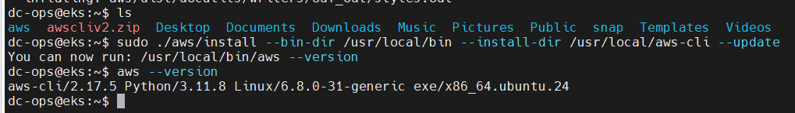

### Create an IAM Role for EKS.
  - Create an IAM role with the necessary permissions for EKS.
    01. ___Create an IAM User__:
        * Go to the AWS IAM console.
        * Create a new IAM user named ```eks-cli-admin.```
        * Attach the ```AdministratorAccess``` policy to this user.
    02. Create Security Credentials:
        * After creating the user, generate an ```Access``` and ```Secret Access``` Key for ``eks-cli-admin`` user.

### Configure AWS:
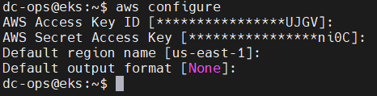

* Will try to access the S3 
```sh
$ aws s3 ls
```

## Kubectl is a tool you use from the command line to work with Kubernetes clusters. It helps you manage and control the different parts of your Kubernetes system.

With Kubectl, you can do things like:

- Deploy applications
- Check and update cluster resources
- Scale up or down your deployments
- Troubleshoot problems

### Kubernetes tools setup: 

01. Will install the ```kubectl``` on machine. [Ref Link](https://kubernetes.io/docs/tasks/tools/install-kubectl-linux/)
```sh
curl -LO "https://dl.k8s.io/release/$(curl -L -s https://dl.k8s.io/release/stable.txt)/bin/linux/amd64/kubectl"
# for AWS machine you can use (curl -o kubectl https://amazon-eks.s3.us-west2.amazonaws.com/1.19.6/2021-01-05/bin/linux/amd64/kubectl )
chmod +x ./kubectl
sudo mv ./kubectl /usr/local/bin
```
* Test to ensure the version you installed is up-to-date:
```sh
kubectl version --client

or

use this for detailed view of version:

kubectl version --client --output=yaml
```
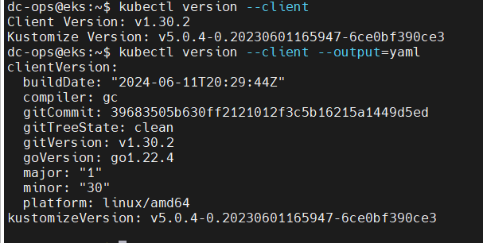

02. Install ```eksctl``` tool: [Ref Link](https://docs.aws.amazon.com/emr/latest/EMR-on-EKS-DevelopmentGuide/setting-up-eksctl.html)

```sh
curl --silent --location "https://github.com/weaveworks/eksctl/releases/latest/download/eksctl_$(uname -s)_amd64.tar.gz" | tar xz -C /tmp
sudo mv /tmp/eksctl /usr/local/bin
eksctl version
```
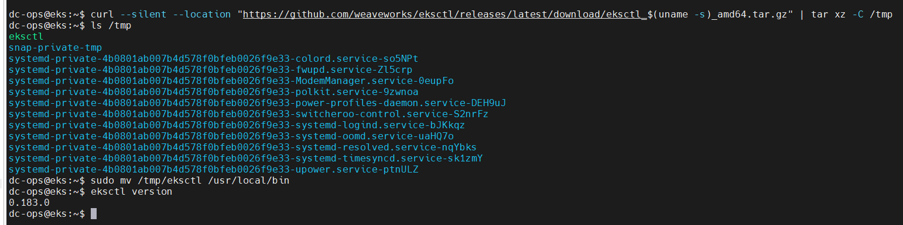

```sh
$ eksctl version
0.183.0
```

03. Will setup ```EKS Cluster``` Setup now:

- Use eksctl to create the EKS cluster

```sh
eksctl create cluster --name demo-singh-eks --region us-east-1 --node-type t2.micro --nodes-min 2 --nodes-max 3

```
__NOTE__: Make sure to replace ```<cluster-name>``` and ```<region>``` when execute the command.

__*Note__:* Clustering will take approximately ```20–30``` minutes to create a cluster.

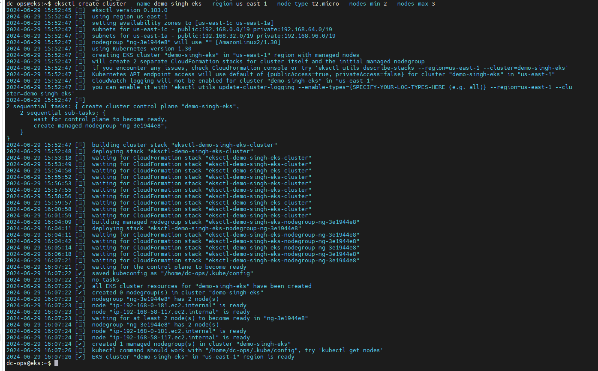

- View AWS console: 
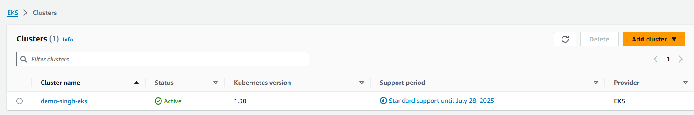

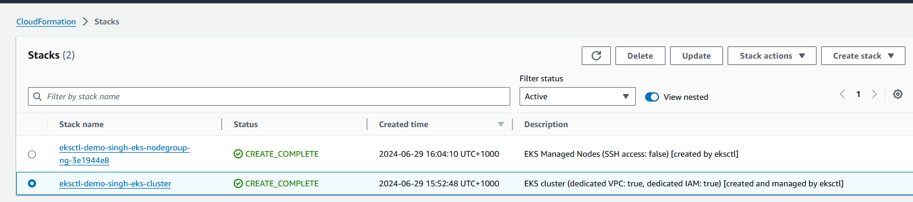

*Current Nodes Status:*
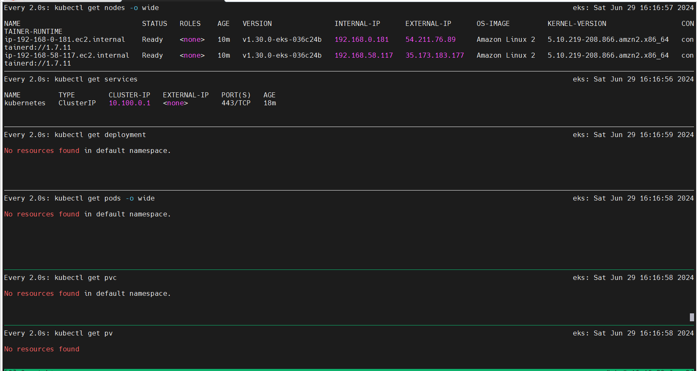

#### Basic commands:
1. Get Cluster Information
```sh
aws eks describe-cluster --name <cluster-name> --region <region>
```
2. List Worker Nodes
```sh
kubectl get nodes
```
3. Deploy an application
```sh
kubectl apply -f <yaml-file>
```
4. Scale a Deployment
```sh
 kubectl scale deployment <deployment-name> --replicas=<number>
 ```
5. View Pods in a Namespace
```sh
kubectl get pods -n <namespace>
```
6. Check Cluster Events
```sh
kubectl get events
```
7. Create a Persistent Volume
```sh
kubectl apply -f <pv-definition.yaml>
```
8. Apply a Rolling Update
```sh
kubectl set image deployment/<deployment-name> <container-name>=<newimage>
```
9. Enable Autoscaling
```sh
kubectl autoscale deployment <deployment-name> --min=3 --max=5
```

Will clone the [repo](https://github.com/mrbalraj007/two-tier-flask-app) and will use the manifests file:

- will go to directory ```two-tier-flask-app/eks-manifests```

    - will create a DB first.
```sh
s$ kubectl apply -f mysql-secrets.yml -f mysql-configmap.yml -f mysql-deployment.yml -f mysql-svc.yml

secret/mysql-secret created
configmap/mysql-initdb-config created
deployment.apps/mysql created
service/mysql created
```

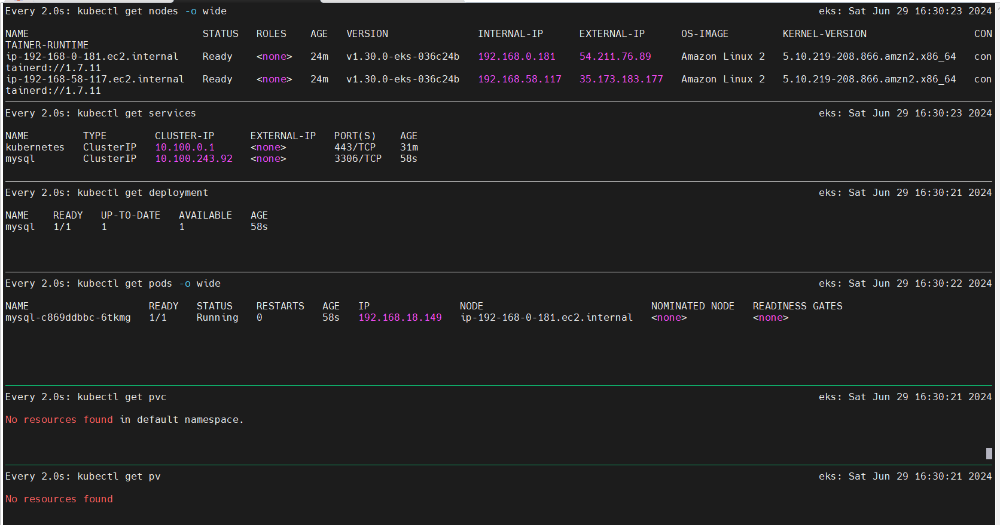

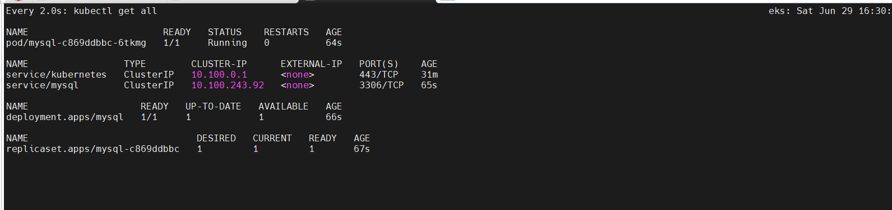

```sh
$ kubectl apply -f two-tier-app-deployment.yml -f two-tier-app-svc.yml

deployment.apps/two-tier-app created
service/two-tier-app-service created
```
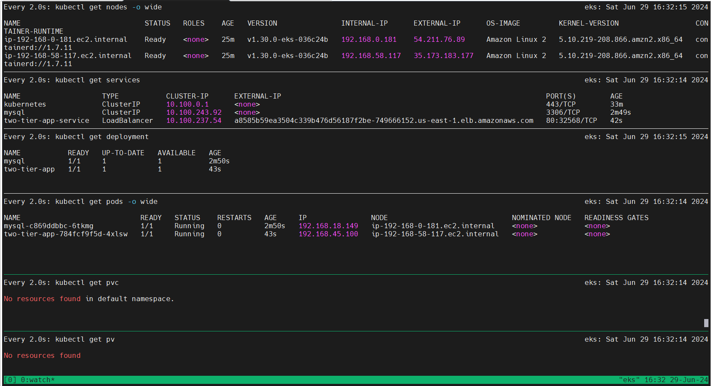

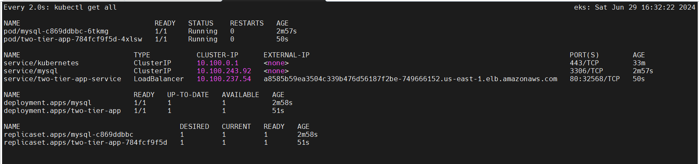

- will investigate the SQL pod to verify that file are injected or not.

```sh
$ kubectl describe pod mysql-c869ddbbc-6tkmg | grep -A 5 "Volumes"
Volumes:
  mysql-initdb:
    Type:      ConfigMap (a volume populated by a ConfigMap)
    Name:      mysql-initdb-config
    Optional:  false
  kube-api-access-dv7rl:
```

Will try to access site in browser, and will take the IP address/ name from ```kubectl get services```.
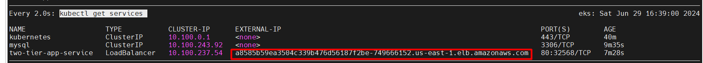

and Site is accecssilbe :-)
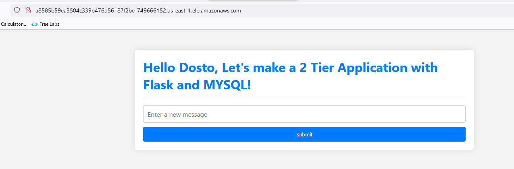

### To Delete the cluster
```sh
eksctl delete cluster --name demo-singh-eks --region us-east-1
```
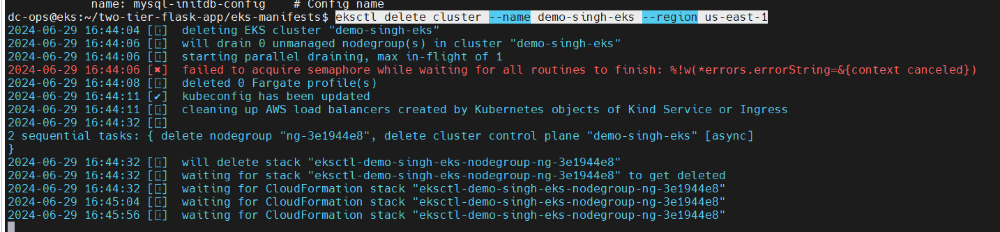

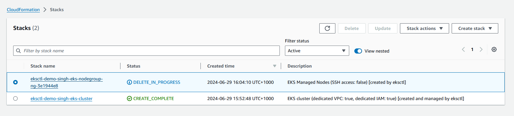

