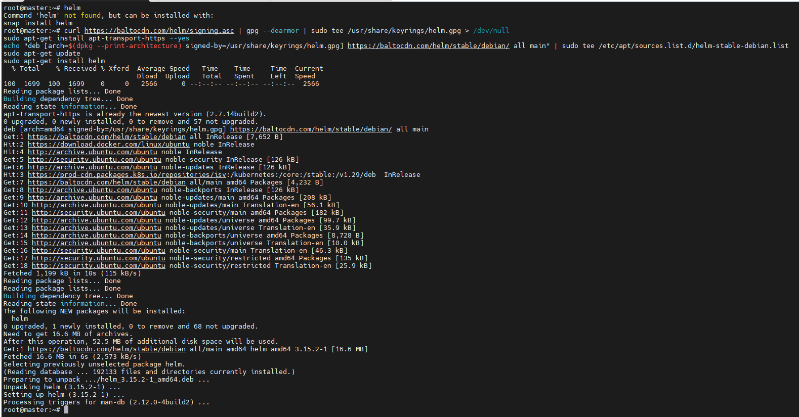
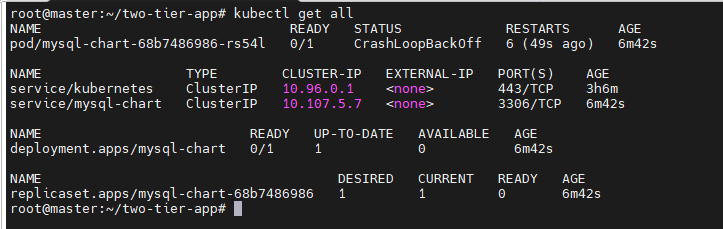
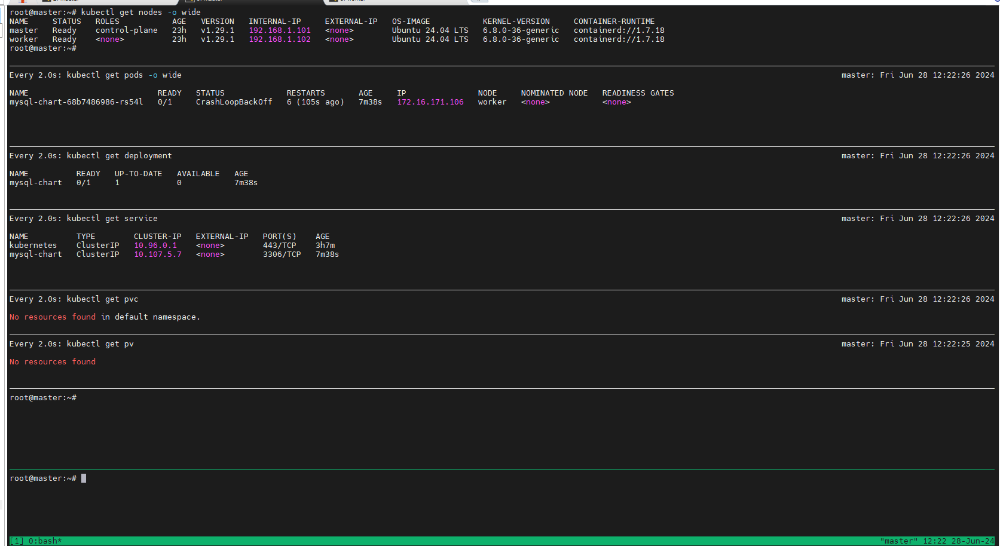
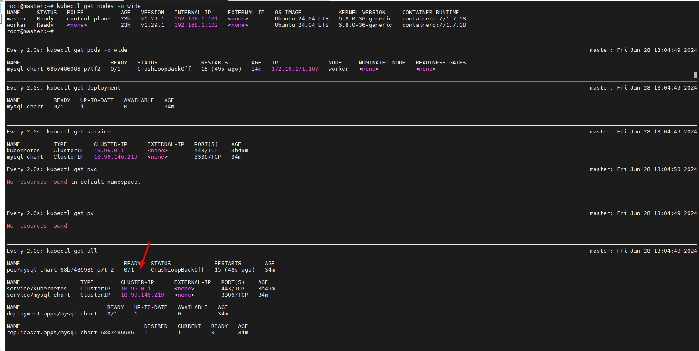
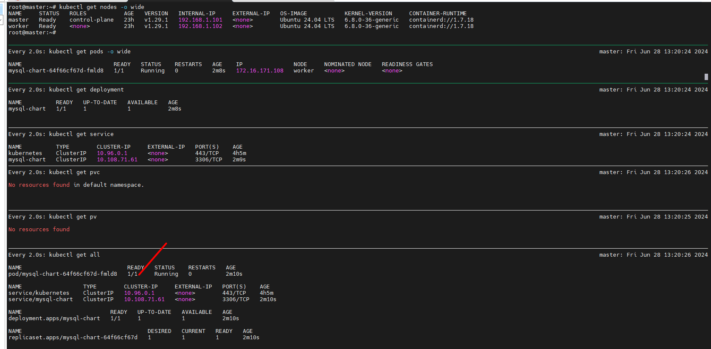
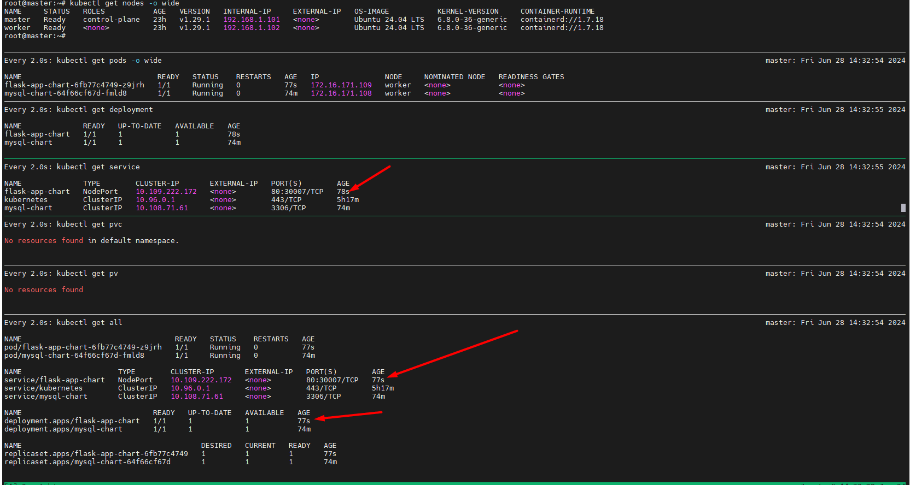
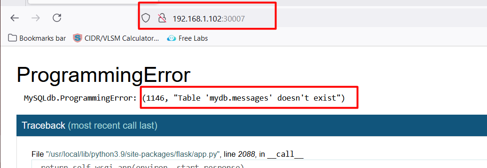
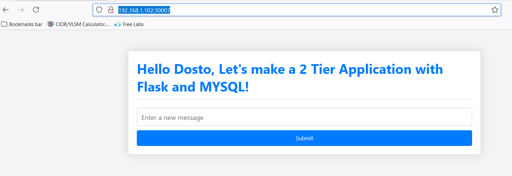

# Deploy 2 Tier application on Helm. 
- *Flask App with MySQL Helm Setup*

Helm, a package manager for Kubernetes that manages and packages all the necessary manifest files for deploying an application, making installation, upgrades, and uninstallation easier.

 Helm provides templates for deployment files, service files, and other Kubernetes manifests, automating their creation and simplifying the process by standardizing repetitive elements.

## Section 2: Prerequisites
- Helm installed
- Kubernetes cluster set up (e.g., Minikube, kind, or any cloud-based Kubernetes)
- Docker installed (Optional for custom images)
- Basic understanding of Kubernetes resources like Pod, Service, Deployment

[Ref link:](https://github.com/mrbalraj007/kubestarter/blob/main/examples/helm/README.md)

 ```sh
 # helm
Command 'helm' not found, but can be installed with:
snap install helm
```

+ How to Install helm in Ubuntu.
    - In continuation of the day (Kubernetecs), we will run the following code on the ```master``` node:.
```sh
curl https://baltocdn.com/helm/signing.asc | gpg --dearmor | sudo tee /usr/share/keyrings/helm.gpg > /dev/null
sudo apt-get install apt-transport-https --yes
echo "deb [arch=$(dpkg --print-architecture) signed-by=/usr/share/keyrings/helm.gpg] https://baltocdn.com/helm/stable/debian/ all main" | sudo tee /etc/apt/sources.list.d/helm-stable-debian.list
sudo apt-get update
sudo apt-get install helm
```


- These are the helm commands:
```powershell
 helm
The Kubernetes package manager

Common actions for Helm:

- helm search:    search for charts
- helm pull:      download a chart to your local directory to view
- helm install:   upload the chart to Kubernetes
- helm list:      list releases of charts

Environment variables:

| Name                               | Description                                                                                                |
|------------------------------------|------------------------------------------------------------------------------------------------------------|
| $HELM_CACHE_HOME                   | set an alternative location for storing cached files.                                                      |
| $HELM_CONFIG_HOME                  | set an alternative location for storing Helm configuration.                                                |
| $HELM_DATA_HOME                    | set an alternative location for storing Helm data.                                                         |
| $HELM_DEBUG                        | indicate whether or not Helm is running in Debug mode                                                      |
| $HELM_DRIVER                       | set the backend storage driver. Values are: configmap, secret, memory, sql.                                |
| $HELM_DRIVER_SQL_CONNECTION_STRING | set the connection string the SQL storage driver should use.                                               |
| $HELM_MAX_HISTORY                  | set the maximum number of helm release history.                                                            |
| $HELM_NAMESPACE                    | set the namespace used for the helm operations.                                                            |
| $HELM_NO_PLUGINS                   | disable plugins. Set HELM_NO_PLUGINS=1 to disable plugins.                                                 |
| $HELM_PLUGINS                      | set the path to the plugins directory                                                                      |
| $HELM_REGISTRY_CONFIG              | set the path to the registry config file.                                                                  |
| $HELM_REPOSITORY_CACHE             | set the path to the repository cache directory                                                             |
| $HELM_REPOSITORY_CONFIG            | set the path to the repositories file.                                                                     |
| $KUBECONFIG                        | set an alternative Kubernetes configuration file (default "~/.kube/config")                                |
| $HELM_KUBEAPISERVER                | set the Kubernetes API Server Endpoint for authentication                                                  |
| $HELM_KUBECAFILE                   | set the Kubernetes certificate authority file.                                                             |
| $HELM_KUBEASGROUPS                 | set the Groups to use for impersonation using a comma-separated list.                                      |
| $HELM_KUBEASUSER                   | set the Username to impersonate for the operation.                                                         |
| $HELM_KUBECONTEXT                  | set the name of the kubeconfig context.                                                                    |
| $HELM_KUBETOKEN                    | set the Bearer KubeToken used for authentication.                                                          |
| $HELM_KUBEINSECURE_SKIP_TLS_VERIFY | indicate if the Kubernetes API server's certificate validation should be skipped (insecure)                |
| $HELM_KUBETLS_SERVER_NAME          | set the server name used to validate the Kubernetes API server certificate                                 |
| $HELM_BURST_LIMIT                  | set the default burst limit in the case the server contains many CRDs (default 100, -1 to disable)         |
| $HELM_QPS                          | set the Queries Per Second in cases where a high number of calls exceed the option for higher burst values |

Helm stores cache, configuration, and data based on the following configuration order:

- If a HELM_*_HOME environment variable is set, it will be used
- Otherwise, on systems supporting the XDG base directory specification, the XDG variables will be used
- When no other location is set a default location will be used based on the operating system

By default, the default directories depend on the Operating System. The defaults are listed below:

| Operating System | Cache Path                | Configuration Path             | Data Path               |
|------------------|---------------------------|--------------------------------|-------------------------|
| Linux            | $HOME/.cache/helm         | $HOME/.config/helm             | $HOME/.local/share/helm |
| macOS            | $HOME/Library/Caches/helm | $HOME/Library/Preferences/helm | $HOME/Library/helm      |
| Windows          | %TEMP%\helm               | %APPDATA%\helm                 | %APPDATA%\helm          |

Usage:
  helm [command]

Available Commands:
  completion  generate autocompletion scripts for the specified shell
  create      create a new chart with the given name
  dependency  manage a chart's dependencies
  env         helm client environment information
  get         download extended information of a named release
  help        Help about any command
  history     fetch release history
  install     install a chart
  lint        examine a chart for possible issues
  list        list releases
  package     package a chart directory into a chart archive
  plugin      install, list, or uninstall Helm plugins
  pull        download a chart from a repository and (optionally) unpack it in local directory
  push        push a chart to remote
  registry    login to or logout from a registry
  repo        add, list, remove, update, and index chart repositories
  rollback    roll back a release to a previous revision
  search      search for a keyword in charts
  show        show information of a chart
  status      display the status of the named release
  template    locally render templates
  test        run tests for a release
  uninstall   uninstall a release
  upgrade     upgrade a release
  verify      verify that a chart at the given path has been signed and is valid
  version     print the client version information

Flags:
      --burst-limit int                 client-side default throttling limit (default 100)
      --debug                           enable verbose output
  -h, --help                            help for helm
      --kube-apiserver string           the address and the port for the Kubernetes API server
      --kube-as-group stringArray       group to impersonate for the operation, this flag can be repeated to specify multiple groups.
      --kube-as-user string             username to impersonate for the operation
      --kube-ca-file string             the certificate authority file for the Kubernetes API server connection
      --kube-context string             name of the kubeconfig context to use
      --kube-insecure-skip-tls-verify   if true, the Kubernetes API server's certificate will not be checked for validity. This will make your HTTPS connections insecure
      --kube-tls-server-name string     server name to use for Kubernetes API server certificate validation. If it is not provided, the hostname used to contact the server is used
      --kube-token string               bearer token used for authentication
      --kubeconfig string               path to the kubeconfig file
  -n, --namespace string                namespace scope for this request
      --qps float32                     queries per second used when communicating with the Kubernetes API, not including bursting
      --registry-config string          path to the registry config file (default "/root/.config/helm/registry/config.json")
      --repository-cache string         path to the file containing cached repository indexes (default "/root/.cache/helm/repository")
      --repository-config string        path to the file containing repository names and URLs (default "/root/.config/helm/repositories.yaml")

Use "helm [command] --help" for more information about a command.
````

+ example: we will create a nginx chart

```sh
helm create nginx-chart
```
```sh
root@master:~# helm create nginx-chart
Creating nginx-chart

root@master:~# ls -l
total 12
drwxr-xr-x 4 root root 4096 Jun 28 11:48 nginx-chart
drwx------ 6 root root 4096 May 23 10:19 snap
drwxr-xr-x 7 root root 4096 Jun 27 15:38 two-tier-flask-app

root@master:~# cd nginx-chart/

root@master:~/nginx-chart# ls
charts  Chart.yaml  templates  values.yaml   # will create these four folder by default.

root@master:~/nginx-chart# ls -ltr
total 16
-rw-r--r-- 1 root root 1147 Jun 28 11:48 Chart.yaml
-rw-r--r-- 1 root root 2364 Jun 28 11:48 values.yaml
drwxr-xr-x 3 root root 4096 Jun 28 11:48 templates
drwxr-xr-x 2 root root 4096 Jun 28 11:48 charts
root@master:~/nginx-chart#
```

### We will create a ```Backend``` 

- will create a folder ```two-tier-app``` and generate mysql package.
```sh
# mkdir two-tier-app
root@master:~# cd two-tier-app/

root@master:~/two-tier-app# ls

root@master:~/two-tier-app# helm create mysql-chart
Creating mysql-chart

root@master:~/two-tier-app# ls
mysql-chart


root@master:~/two-tier-app# cd mysql-chart/
root@master:~/two-tier-app/mysql-chart# ls
charts  Chart.yaml  templates  values.yaml
root@master:~/two-tier-app/mysql-chart# tree
.
├── charts
├── Chart.yaml
├── templates
│   ├── deployment.yaml
│   ├── _helpers.tpl
│   ├── hpa.yaml
│   ├── ingress.yaml
│   ├── NOTES.txt
│   ├── serviceaccount.yaml
│   ├── service.yaml
│   └── tests
│       └── test-connection.yaml
└── values.yaml

4 directories, 10 files
```
**** *helm bydefaul create a chart for Nginx*

will go to values.yaml file and modify it accordingly.
vi values.yaml
```yaml
# cat values.yaml
# Default values for mysql-chart.
# This is a YAML-formatted file.
# Declare variables to be passed into your templates.

replicaCount: 1

image:
  repository: mysql
  pullPolicy: IfNotPresent
  # Overrides the image tag whose default is the chart appVersion.
  tag: "latest"

# define the environment and it's value to inject in deployment.
env:
  mysqlrootpw: admin
  mysqldb: mydb
  mysqluser: admin
  mysqlpass: admin
imagePullSecrets: []
nameOverride: ""
fullnameOverride: ""

serviceAccount:
  # Specifies whether a service account should be created
  create: true
  # Automatically mount a ServiceAccount's API credentials?
  automount: true
  # Annotations to add to the service account
  annotations: {}
  # The name of the service account to use.
  # If not set and create is true, a name is generated using the fullname template
  name: ""

podAnnotations: {}
podLabels: {}

podSecurityContext: {}
  # fsGroup: 2000

securityContext: {}
  # capabilities:
  #   drop:
  #   - ALL
  # readOnlyRootFilesystem: true
  # runAsNonRoot: true
  # runAsUser: 1000

service:
  type: ClusterIP
  port: 3306

ingress:
  enabled: false
  className: ""
  annotations: {}
    # kubernetes.io/ingress.class: nginx
    # kubernetes.io/tls-acme: "true"
  hosts:
    - host: chart-example.local
      paths:
        - path: /
          pathType: ImplementationSpecific
  tls: []
  #  - secretName: chart-example-tls
  #    hosts:
  #      - chart-example.local

resources: {}
  # We usually recommend not to specify default resources and to leave this as a conscious
  # choice for the user. This also increases chances charts run on environments with little
  # resources, such as Minikube. If you do want to specify resources, uncomment the following
  # lines, adjust them as necessary, and remove the curly braces after 'resources:'.
  # limits:
  #   cpu: 100m
  #   memory: 128Mi
  # requests:
  #   cpu: 100m
  #   memory: 128Mi

livenessProbe:
  httpGet:
    path: /
    port: http
readinessProbe:
  httpGet:
    path: /
    port: http

autoscaling:
  enabled: false
  minReplicas: 1
  maxReplicas: 100
  targetCPUUtilizationPercentage: 80
  # targetMemoryUtilizationPercentage: 80

# Additional volumes on the output Deployment definition.
volumes: []
# - name: foo
#   secret:
#     secretName: mysecret
#     optional: false

# Additional volumeMounts on the output Deployment definition.
volumeMounts: []
# - name: foo
#   mountPath: "/etc/foo"
#   readOnly: true

nodeSelector: {}

tolerations: []

affinity: {}
root@master:~/two-tier-app/mysql-chart#
```
```yaml
root@master:~/two-tier-app/mysql-chart# cat templates/deployment.yaml
apiVersion: apps/v1
kind: Deployment
metadata:
  name: {{ include "mysql-chart.fullname" . }}
  labels:
    {{- include "mysql-chart.labels" . | nindent 4 }}
spec:
  {{- if not .Values.autoscaling.enabled }}
  replicas: {{ .Values.replicaCount }}
  {{- end }}
  selector:
    matchLabels:
      {{- include "mysql-chart.selectorLabels" . | nindent 6 }}
  template:
    metadata:
      {{- with .Values.podAnnotations }}
      annotations:
        {{- toYaml . | nindent 8 }}
      {{- end }}
      labels:
        {{- include "mysql-chart.labels" . | nindent 8 }}
        {{- with .Values.podLabels }}
        {{- toYaml . | nindent 8 }}
        {{- end }}
    spec:
      {{- with .Values.imagePullSecrets }}
      imagePullSecrets:
        {{- toYaml . | nindent 8 }}
      {{- end }}
      serviceAccountName: {{ include "mysql-chart.serviceAccountName" . }}
      securityContext:
        {{- toYaml .Values.podSecurityContext | nindent 8 }}
      containers:
        - name: {{ .Chart.Name }}
          securityContext:
            {{- toYaml .Values.securityContext | nindent 12 }}
          image: "{{ .Values.image.repository }}:{{ .Values.image.tag | default .Chart.AppVersion }}"
          imagePullPolicy: {{ .Values.image.pullPolicy }}
          # ************************call the env value here in deployment ******************************
          env:
            - name: MYSQL_ROOT_PASSWORD
              value: {{ .Values.env.mysqlrootpw }}
            - name: MYSQL_DATABASE
              value: {{ .Values.env.mysqldb }}
            - name: MYSQL_USER
              value: {{ .Values.env.mysqluser }}
            - name: MYSQL_PASSWORD
              value: {{ .Values.env.mysqlpass }}
          ports:
            - name: http
              containerPort: {{ .Values.service.port }}
              protocol: TCP
          livenessProbe:
            {{- toYaml .Values.livenessProbe | nindent 12 }}
          readinessProbe:
            {{- toYaml .Values.readinessProbe | nindent 12 }}
          resources:
            {{- toYaml .Values.resources | nindent 12 }}
          {{- with .Values.volumeMounts }}
          volumeMounts:
            {{- toYaml . | nindent 12 }}
          {{- end }}
      {{- with .Values.volumes }}
      volumes:
        {{- toYaml . | nindent 8 }}
      {{- end }}
      {{- with .Values.nodeSelector }}
      nodeSelector:
        {{- toYaml . | nindent 8 }}
      {{- end }}
      {{- with .Values.affinity }}
      affinity:
        {{- toYaml . | nindent 8 }}
      {{- end }}
      {{- with .Values.tolerations }}
      tolerations:
        {{- toYaml . | nindent 8 }}
      {{- end }}
root@master:~/two-tier-app/mysql-chart#
```

Now, we have to package it. Current directory path is:
```sh
root@master:~/two-tier-app# pwd
/root/two-tier-app
```
Will run the following command:
```sh
# helm package mysql-chart
Successfully packaged chart and saved it to: /root/two-tier-app/mysql-chart-0.1.0.tgz

# ls
mysql-chart  mysql-chart-0.1.0.tgz
root@master:~/two-tier-app#
```

Now, we will install/run it. 
```helm install <Chartname> <packagename```

```sh
# helm install mysql-chart ./mysql-chart
NAME: mysql-chart
LAST DEPLOYED: Fri Jun 28 12:14:47 2024
NAMESPACE: default
STATUS: deployed
REVISION: 1
NOTES:
1. Get the application URL by running these commands:
  export POD_NAME=$(kubectl get pods --namespace default -l "app.kubernetes.io/name=mysql-chart,app.kubernetes.io/instance=mysql-chart" -o jsonpath="{.items[0].metadata.name}")
  export CONTAINER_PORT=$(kubectl get pod --namespace default $POD_NAME -o jsonpath="{.spec.containers[0].ports[0].containerPort}")
  echo "Visit http://127.0.0.1:8080 to use your application"
  kubectl --namespace default port-forward $POD_NAME 8080:$CONTAINER_PORT
```
Successfully created.
```sh
kubectl get all
```




```yaml
# helm list
NAME            NAMESPACE       REVISION        UPDATED                                         STATUS          CHART                   APP VERSION
mysql-chart     default         1               2024-06-28 12:14:47.093060592 +1000 AEST        deployed        mysql-chart-0.1.0       1.16.0
```
```sh
# helm uninstall mysql-chart
release "mysql-chart" uninstalled

root@master:~/two-tier-app# helm list
NAME    NAMESPACE       REVISION        UPDATED STATUS  CHART   APP VERSION
root@master:~/two-tier-app#
```
```sh
# kubectl get all
NAME                 TYPE        CLUSTER-IP   EXTERNAL-IP   PORT(S)   AGE
service/kubernetes   ClusterIP   10.96.0.1    <none>        443/TCP   3h12m
root@master:~/two-tier-app#
```
* install <> up
* uninstall <> down

```sh
# helm package mysql-chart
Successfully packaged chart and saved it to: /root/two-tier-app/mysql-chart-0.1.0.tgz
root@master:~/two-tier-app# ls -l
total 12
drwxr-xr-x 4 root root 4096 Jun 28 12:25 mysql-chart
-rw-r--r-- 1 root root 4128 Jun 28 12:30 mysql-chart-0.1.0.tgz
root@master:~/two-tier-app# helm install mysql-chart ./mysql-chart
NAME: mysql-chart
LAST DEPLOYED: Fri Jun 28 12:30:30 2024
NAMESPACE: default
STATUS: deployed
REVISION: 1
NOTES:
1. Get the application URL by running these commands:
  export POD_NAME=$(kubectl get pods --namespace default -l "app.kubernetes.io/name=mysql-chart,app.kubernetes.io/instance=mysql-chart" -o jsonpath="{.items[0].metadata.name}")
  export CONTAINER_PORT=$(kubectl get pod --namespace default $POD_NAME -o jsonpath="{.spec.containers[0].ports[0].containerPort}")
  echo "Visit http://127.0.0.1:8080 to use your application"
  kubectl --namespace default port-forward $POD_NAME 8080:$CONTAINER_PORT
root@master:~/two-tier-app#
```
It is running but no fully active, because of additional line available file.


```sh
# cat values.yaml
# Default values for mysql-chart.
# This is a YAML-formatted file.
# Declare variables to be passed into your templates.

replicaCount: 1

image:
  repository: mysql
  pullPolicy: IfNotPresent
  # Overrides the image tag whose default is the chart appVersion.
  tag: "latest"

# define the environment and it's value to inject in deployment.
env:
  mysqlrootpw: admin
  mysqldb: mydb
  mysqluser: admin
  mysqlpass: admin
imagePullSecrets: []
nameOverride: ""
fullnameOverride: ""

serviceAccount:
  # Specifies whether a service account should be created
  create: true
  # Automatically mount a ServiceAccount's API credentials?
  automount: true
  # Annotations to add to the service account
  annotations: {}
  # The name of the service account to use.
  # If not set and create is true, a name is generated using the fullname template
  name: ""

podAnnotations: {}
podLabels: {}

podSecurityContext: {}
  # fsGroup: 2000

securityContext: {}
  # capabilities:
  #   drop:
  #   - ALL
  # readOnlyRootFilesystem: true
  # runAsNonRoot: true
  # runAsUser: 1000

service:
  type: ClusterIP
  port: 3306

ingress:
  enabled: false
  className: ""
  annotations: {}
    # kubernetes.io/ingress.class: nginx
    # kubernetes.io/tls-acme: "true"
  hosts:
    - host: chart-example.local
      paths:
        - path: /
          pathType: ImplementationSpecific
  tls: []
  #  - secretName: chart-example-tls
  #    hosts:
  #      - chart-example.local

resources: {}
  # We usually recommend not to specify default resources and to leave this as a conscious
  # choice for the user. This also increases chances charts run on environments with little
  # resources, such as Minikube. If you do want to specify resources, uncomment the following
  # lines, adjust them as necessary, and remove the curly braces after 'resources:'.
  # limits:
  #   cpu: 100m
  #   memory: 128Mi
  # requests:
  #   cpu: 100m
  #   memory: 128Mi

### This was keep blocking because we were not using it.
  #livenessProbe:
  #httpGet:
  #  path: /
  #  port: http
  # readinessProbe:
  #httpGet:
  #  path: /
  #  port: http

autoscaling:
  enabled: false
  minReplicas: 1
  maxReplicas: 100
  targetCPUUtilizationPercentage: 80
  # targetMemoryUtilizationPercentage: 80

# Additional volumes on the output Deployment definition.
volumes: []
# - name: foo
#   secret:
#     secretName: mysecret
#     optional: false

# Additional volumeMounts on the output Deployment definition.
volumeMounts: []
# - name: foo
#   mountPath: "/etc/foo"
#   readOnly: true

nodeSelector: {}

tolerations: []

affinity: {}
root@master:~/two-tier-app/mysql-chart#
```

```yaml
root@master:~/two-tier-app/mysql-chart# helm list
NAME            NAMESPACE       REVISION        UPDATED                                         STATUS          CHART                   APP VERSION
mysql-chart     default         1               2024-06-28 12:30:30.516365926 +1000 AEST        deployed        mysql-chart-0.1.0       1.16.0

root@master:~/two-tier-app/mysql-chart# helm uninstall mysql-chart
release "mysql-chart" uninstalled

root@master:~/two-tier-app/mysql-chart# helm package mysql-chart
Error: stat mysql-chart: no such file or directory

root@master:~/two-tier-app/mysql-chart# cd ..
root@master:~/two-tier-app# helm package mysql-chart
Successfully packaged chart and saved it to: /root/two-tier-app/mysql-chart-0.1.0.tgz

root@master:~/two-tier-app# helm install mysql-chart ./mysql-chart
NAME: mysql-chart
LAST DEPLOYED: Fri Jun 28 13:18:16 2024
NAMESPACE: default
STATUS: deployed
REVISION: 1
NOTES:
1. Get the application URL by running these commands:
  export POD_NAME=$(kubectl get pods --namespace default -l "app.kubernetes.io/name=mysql-chart,app.kubernetes.io/instance=mysql-chart" -o jsonpath="{.items[0].metadata.name}")
  export CONTAINER_PORT=$(kubectl get pod --namespace default $POD_NAME -o jsonpath="{.spec.containers[0].ports[0].containerPort}")
  echo "Visit http://127.0.0.1:8080 to use your application"
  kubectl --namespace default port-forward $POD_NAME 8080:$CONTAINER_PORT
root@master:~/two-tier-app#
```
Current Status:


Now, we will try to connect SQL
```sh
root@master:~/two-tier-app# kubectl exec -it mysql-chart-64f66cf67d-fmld8 -- /bin/bash

bash-5.1# mysql -u admin -p
Enter password:
Welcome to the MySQL monitor.  Commands end with ; or \g.
Your MySQL connection id is 9
Server version: 8.4.0 MySQL Community Server - GPL

Copyright (c) 2000, 2024, Oracle and/or its affiliates.

Oracle is a registered trademark of Oracle Corporation and/or its
affiliates. Other names may be trademarks of their respective
owners.

Type 'help;' or '\h' for help. Type '\c' to clear the current input statement.

mysql>
```

### Now, time to create a ```Frontend```
```sh
# helm create flask-app-chart
Creating flask-app-chart

root@master:~/two-tier-app# ls -l
total 16
drwxr-xr-x 4 root root 4096 Jun 28 13:28 flask-app-chart
drwxr-xr-x 4 root root 4096 Jun 28 13:09 mysql-chart
-rw-r--r-- 1 root root 4135 Jun 28 13:17 mysql-chart-0.1.0.tgz

root@master:~/two-tier-app# cd flask-app-chart/

root@master:~/two-tier-app/flask-app-chart# ls
charts  Chart.yaml  templates  values.yaml
```
will modify the ```values.yaml```, ```templates/services.yaml``` and ```templates/deployment.yaml```
- code can be get from my repo:

Now, you can check all of the code using the ```template``` parameter. It will show you all of the manifist file.
```sh
# helm template flask-app-chart
---
# Source: flask-app-chart/templates/serviceaccount.yaml
apiVersion: v1
kind: ServiceAccount
metadata:
  name: release-name-flask-app-chart
  labels:
    helm.sh/chart: flask-app-chart-0.1.0
    app.kubernetes.io/name: flask-app-chart
    app.kubernetes.io/instance: release-name
    app.kubernetes.io/version: "1.16.0"
    app.kubernetes.io/managed-by: Helm
automountServiceAccountToken: true
---
# Source: flask-app-chart/templates/service.yaml
apiVersion: v1
kind: Service
metadata:
  name: release-name-flask-app-chart
  labels:
    helm.sh/chart: flask-app-chart-0.1.0
    app.kubernetes.io/name: flask-app-chart
    app.kubernetes.io/instance: release-name
    app.kubernetes.io/version: "1.16.0"
    app.kubernetes.io/managed-by: Helm
spec:
  type: NodePort
  ports:
    - port: 80
      targetPort: 5000
      nodePort: 30007
      protocol: TCP
      name: http
  selector:
    app.kubernetes.io/name: flask-app-chart
    app.kubernetes.io/instance: release-name
---
# Source: flask-app-chart/templates/deployment.yaml
apiVersion: apps/v1
kind: Deployment
metadata:
  name: release-name-flask-app-chart
  labels:
    helm.sh/chart: flask-app-chart-0.1.0
    app.kubernetes.io/name: flask-app-chart
    app.kubernetes.io/instance: release-name
    app.kubernetes.io/version: "1.16.0"
    app.kubernetes.io/managed-by: Helm
spec:
  replicas: 1
  selector:
    matchLabels:
      app.kubernetes.io/name: flask-app-chart
      app.kubernetes.io/instance: release-name
  template:
    metadata:
      labels:
        helm.sh/chart: flask-app-chart-0.1.0
        app.kubernetes.io/name: flask-app-chart
        app.kubernetes.io/instance: release-name
        app.kubernetes.io/version: "1.16.0"
        app.kubernetes.io/managed-by: Helm
    spec:
      serviceAccountName: release-name-flask-app-chart
      securityContext:
        {}
      containers:
        - name: flask-app-chart
          securityContext:
            {}
          image: "balrajsi/flaskapp:latest"
          imagePullPolicy: IfNotPresent
          env:
            - name: MYSQL_HOST
              value: 10.108.71.61  # this value is comming from the values.yml
            - name: MYSQL_PASSWORD
              value: admin
            - name: MYSQL_USER
              value: admin
            - name: MYSQL_DB
              value: mydb
          ports:
            - name: http
              containerPort: 5000   # Here also need to change the port because it would be target port
              protocol: TCP
          livenessProbe:
            null
          readinessProbe:
            null
          resources:
            {}
---
# Source: flask-app-chart/templates/tests/test-connection.yaml
apiVersion: v1
kind: Pod
metadata:
  name: "release-name-flask-app-chart-test-connection"
  labels:
    helm.sh/chart: flask-app-chart-0.1.0
    app.kubernetes.io/name: flask-app-chart
    app.kubernetes.io/instance: release-name
    app.kubernetes.io/version: "1.16.0"
    app.kubernetes.io/managed-by: Helm
  annotations:
    "helm.sh/hook": test
spec:
  containers:
    - name: wget
      image: busybox
      command: ['wget']
      args: ['release-name-flask-app-chart:80']
  restartPolicy: Never
root@master:~/two-tier-app#
```
```css
root@master:~/two-tier-app# helm package flask-app-chart
Successfully packaged chart and saved it to: /root/two-tier-app/flask-app-chart-0.1.0.tgz

root@master:~/two-tier-app# helm install flask-app-chart ./flask-app-chart
NAME: flask-app-chart
LAST DEPLOYED: Fri Jun 28 14:31:37 2024
NAMESPACE: default
STATUS: deployed
REVISION: 1
NOTES:
1. Get the application URL by running these commands:
  export NODE_PORT=$(kubectl get --namespace default -o jsonpath="{.spec.ports[0].nodePort}" services flask-app-chart)
  export NODE_IP=$(kubectl get nodes --namespace default -o jsonpath="{.items[0].status.addresses[0].address}")
  echo http://$NODE_IP:$NODE_PORT
root@master:~/two-tier-app#
```


Will try to access it via ```http://192.168.1.102:30007```



will create a entry in DB:
```sh
root@master:~/two-tier-app# kubectl exec -it mysql-chart-64f66cf67d-fmld8 -- /bin/bash
bash-5.1# mysql -u admin -p
Enter password:
Welcome to the MySQL monitor.  Commands end with ; or \g.
Your MySQL connection id is 11
Server version: 8.4.0 MySQL Community Server - GPL

Copyright (c) 2000, 2024, Oracle and/or its affiliates.

Oracle is a registered trademark of Oracle Corporation and/or its
affiliates. Other names may be trademarks of their respective
owners.

Type 'help;' or '\h' for help. Type '\c' to clear the current input statement.

mysql> show databases;
+--------------------+
| Database           |
+--------------------+
| information_schema |
| mydb               |
| performance_schema |
+--------------------+
3 rows in set (0.01 sec)

mysql> use mydb;
Database changed
mysql> CREATE TABLE messages (
    ->     id INT AUTO_INCREMENT PRIMARY KEY,
    ->     message TEXT
    -> );
Query OK, 0 rows affected (0.01 sec)

mysql>
```

Will try to access it again:

