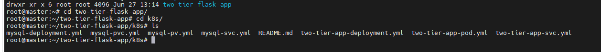
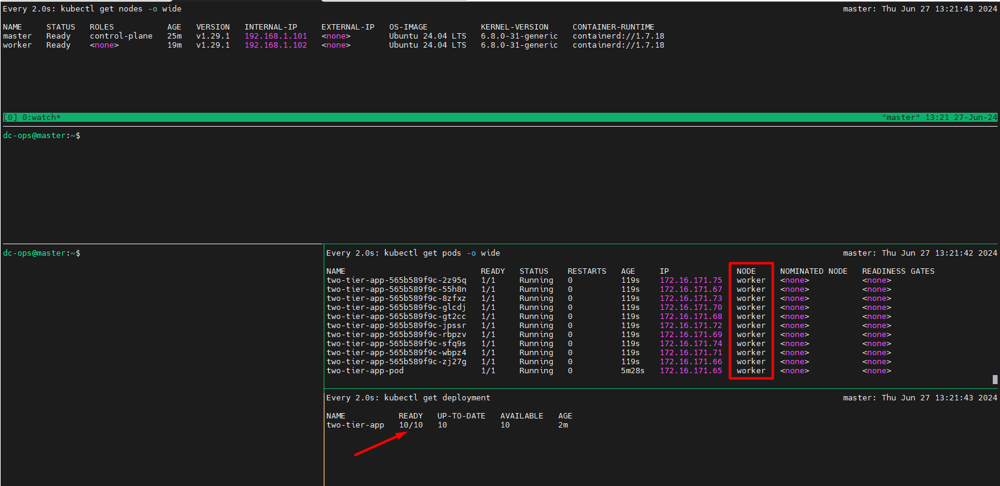
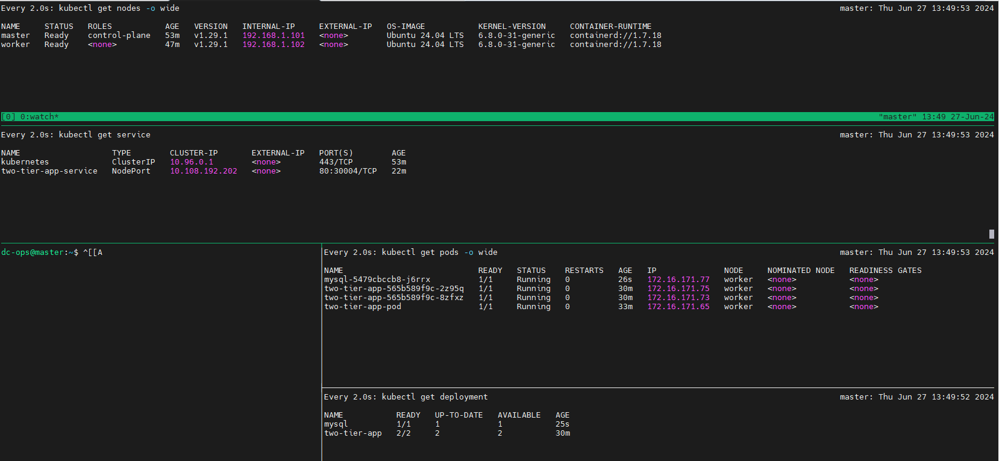

# 2 Tier Application Deployment in Kubeadm Cluster 
---
Lab Setup:

```powershell
master : 192.168.1.101
worker : 192.168.1.102
OS Details: Ubuntu 24.04 LTS
```

cat >>/etc/hosts<<EOF
192.168.1.101   k8s-master     master 
192.168.1.102   k8s-worker1    worker1 
EOF

## Will follow the following command on both ```Master``` and ```Worker```

- Switch to root user
```
sudo su -
```

```sh
# stop and Disable firewall (ufw disable: This command disables the Uncomplicated Firewall (UFW) on the machine, stopping all firewall rules managed by UFW.)
ufw disable

# Ensures that these kernel modules are loaded on boot.
cat >>/etc/modules-load.d/containerd.conf<<EOF
overlay
br_netfilter
EOF
modprobe overlay    # Loads the overlay kernel module.
modprobe br_netfilter # Loads the br_netfilter kernel module.


# Disable and turn off SWAP on both Machine (sed -i '/swap/d' /etc/fstab: This command edits the /etc/fstab file to remove any lines containing "swap". This prevents swap from being enabled on boot.swapoff -a: Disables all swap space immediately.)
sed -i '/swap/d' /etc/fstab ; swapoff -a  

# Update sysctl settings for Kubernetes networking
cat >>/etc/sysctl.d/kubernetes.conf<<EOF
net.bridge.bridge-nf-call-ip6tables = 1
net.bridge.bridge-nf-call-iptables  = 1
net.ipv4.ip_forward                 = 1
EOF
sysctl --system  #Reloads all sysctl configurations to apply the new settings.

# Install containerd runtime
apt update
apt install -qq -y ca-certificates curl gnupg lsb-release  #Installs necessary packages for managing certificates, making HTTP requests, handling GPG keys, and checking the distribution release.

# mkdir -p /etc/apt/keyrings: Creates the directory /etc/apt/keyrings if it doesn't already exist. curl -fsSL ... | gpg --dearmor -o /etc/apt/keyrings/docker.gpg: Downloads the Docker GPG key and converts it to a format that can be used by APT, saving it to /etc/apt/keyrings/docker.gpg.

mkdir -p /etc/apt/keyrings
curl -fsSL https://download.docker.com/linux/ubuntu/gpg | gpg --dearmor -o /etc/apt/keyrings/docker.gpg

# echo ... | tee /etc/apt/sources.list.d/docker.list: Adds the Docker APT repository to the list of sources from which packages can be downloaded.
echo \
  "deb [arch=$(dpkg --print-architecture) signed-by=/etc/apt/keyrings/docker.gpg] https://download.docker.com/linux/ubuntu \ $(lsb_release -cs) stable" | tee /etc/apt/sources.list.d/docker.list

apt update -y
apt install -qq -y containerd.io

# mkdir -p /etc/apt/keyrings: Creates the directory /etc/apt/keyrings if it doesn't already exist. curl -fsSL ... | gpg --dearmor -o /etc/apt/keyrings/docker.gpg: Downloads the Docker GPG key and converts it to a format that can be used by APT, saving it to /etc/apt/keyrings/docker.gpg.

containerd config default > /etc/containerd/config.toml

#sed -i 's/SystemdCgroup = false/SystemdCgroup = true/g' /etc/containerd/config.toml: Modifies the containerd configuration to use systemd for managing cgroups. systemctl restart containerd: Restarts the containerd service to apply the new configuration.systemctl enable containerd >/dev/null: Enables the containerd service to start on boot, suppressing the output.

sed -i 's/SystemdCgroup \= false/SystemdCgroup \= true/g' /etc/containerd/config.toml
systemctl restart containerd
systemctl enable containerd >/dev/null  

# Add the repo for Kubernetes and will install Kubernetes components (kubeadm, kubelet and kubectl)

apt-get update -y
apt-get install -y apt-transport-https ca-certificates curl gpg # Installs necessary packages for secure package management and HTTP transport.


#mkdir -p -m 755 /etc/apt/keyrings: Creates the directory /etc/apt/keyrings with the permissions set to 755 if it doesn't already exist. curl -fsSL ... | sudo gpg --dearmor -o /etc/apt/keyrings/kubernetes-apt-keyring.gpg: Downloads the Kubernetes GPG key and converts it to a format that can be used by APT, saving it to /etc/apt/keyrings/kubernetes-apt-keyring.gpg. echo ... | sudo tee /etc/apt/sources.list.d/kubernetes.list: Adds the Kubernetes APT repository to the list of sources from which packages can be downloaded.

mkdir -p -m 755 /etc/apt/keyrings
curl -fsSL https://pkgs.k8s.io/core:/stable:/v1.29/deb/Release.key | sudo gpg --dearmor -o /etc/apt/keyrings/kubernetes-apt-keyring.gpg
echo 'deb [signed-by=/etc/apt/keyrings/kubernetes-apt-keyring.gpg] https://pkgs.k8s.io/core:/stable:/v1.29/deb/ /' | sudo tee /etc/apt/sources.list.d/kubernetes.list

apt-get update
apt-get install -y kubelet=1.29.* kubeadm=1.29.* kubectl=1.29.*

# apt-mark hold kubelet kubeadm kubectl: Prevents these packages from being automatically updated.
apt-mark hold kubelet kubeadm kubectl
```
* Above command will be applied on both nodes.

# Will execute the command on Master node only
```sh
# Pull required containers
kubeadm config images pull

#### Will initialize Kubernetes Cluster
Note: apiserver-advertise-address is ```master``` server ip address


kubeadm init --apiserver-advertise-address=192.168.1.101 --pod-network-cidr=172.18.0.0/16 

# Deploy Calico network 
kubectl apply -f  https://raw.githubusercontent.com/projectcalico/calico/v3.27.3/manifests/calico.yaml
```

### Cluster Setup:

```sh
kubeadm token create --print-join-command > /comamnd_print-join-cluster.txt
```
- Will run the following command on master node.
To run the command for all users
```sh
mkdir -p $HOME/.kube
sudo cp -i /etc/kubernetes/admin.conf $HOME/.kube/config
sudo chown $(id -u):$(id -g) $HOME/.kube/config
```
- Kubectl auto-complete and k alias

```
echo "source <(kubectl completion bash)" >> ~/.bashrc
alias k=kubectl
complete -o default -F __start_kubectl k
```
### Now,will join worker node in a cluster 
```sh
kubeadm join 192.168.1.101:6443 --token j3j061.4l1p7a5ahn35akom --discovery-token-ca-cert-hash sha256:3b78527a31f4420b2f4cc3f11ca9d54e0ebbff11c7ce8c50f0dae39b0be97f48
```
#### Verify the Cluster
On the master node, verify that the worker node has joined the cluster:
```sh
kubectl get nodes
```
You should see both the master and worker nodes listed and in the Ready state.

``` Obtaining machine-readable output:``` kubectl get can output JSON, YAML, or be directly formatted

Give us more info about the nodes: ```kubectl get nodes -o wide``` or YAML format:  ```kubectl get no -o yaml```

```bash
Troubleshooting Tips : Ensure both servers can communicate over the necessary ports:

6443 (API server)
2379-2380 (etcd)
10250 (kubelet)
10251 (kube-scheduler)
10252 (kube-controller-manager)
```

#### Current Cluster status:


----------------------------------------
[Source Code:](https://github.com/mrbalraj007/two-tier-flask-app)

Will clone from this repo: https://github.com/mrbalraj007/two-tier-flask-app.git
```sh
git clone https://github.com/mrbalraj007/two-tier-flask-app.git
```

 
will go to the direcotry ```two-tier-flask-ap``` and go to ```k8s```


Now, we will deploy the pod:
```sh
$ kubectl apply -f two-tier-app-pod.yml
```


__To scale the pod:__ I have used ```10``` in my deployment file.
```sh
$ kubectl apply -f two-tier-app-deployment.yml
```


If I want to scale down then I'll use the following.
```sh
kubectl scale deployment two-tier-app --replicas=2
```


How to create a service:
```sh
kubectl apply -f two-tier-app-svc.yml
```


Accessible but getting an error because of the database issue.


Will edit in ```mysql-deployment.yml```

will create mysqldatabase folder in the following location:
 mkdir mysqldata
```sh
root@master:~/two-tier-flask-app# mkdir mysqldata
root@master:~/two-tier-flask-app# pwd
/root/two-tier-flask-app
root@master:~/two-tier-flask-app# ls
app.py  docker-compose.yml  Dockerfile  eks-manifests  Jenkinsfile  k8s  Makefile  message.sql  mysqldata  README.md  requirements.txt  templates
root@master:~/two-tier-flask-app#
```
and update in ```mysql-pv.yml```as below
```sh
root@master:~/two-tier-flask-app/k8s# cat mysql-pv.yml
apiVersion: v1
kind: PersistentVolume
metadata:
  name: mysql-pv
spec:
  capacity:
    storage: 256Mi
  volumeMode: Filesystem
  accessModes:
    - ReadWriteOnce
  persistentVolumeReclaimPolicy: Retain
  hostPath:
    path: /root/two-tier-flask-app/mysqldata        #This is your host path where your data will be stored. Make sure to create mysqldata directory in mentioned path
```
```sh
# kubectl apply -f mysql-pv.yml
persistentvolume/mysql-pv created

# kubectl apply -f mysql-pvc.yml
persistentvolumeclaim/mysql-pvc created
```
We need to delete the existing sql deployment and rerun it.
```sh
kubectl get deployments

# kubectl delete deployment mysql
deployment.apps "mysql" deleted
```


we will redeploy the mysql deployment
```sh
kubectl apply -f mysql-deployment.yml
deployment.apps/mysql created
```


Unable to access the site (http://192.168.1.102:30004/) because service is missing, now we will create a service.

```sh
cat mysql-svc.yml
apiVersion: v1
kind: Service
metadata:
  name: mysql
spec:
  selector:
    app: mysql
  ports:
    - port: 3306
      targetPort: 3306
```
```sh
root@master:~/two-tier-flask-app/k8s# kubectl get svc
NAME                   TYPE        CLUSTER-IP       EXTERNAL-IP   PORT(S)        AGE
kubernetes             ClusterIP   10.96.0.1        <none>        443/TCP        55m
two-tier-app-service   NodePort    10.108.192.202   <none>        80:30004/TCP   24m
root@master:~/two-tier-flask-app/k8s#
```
```sh
# kubectl apply -f mysql-svc.yml
service/mysql created
```


Now, we have to update the mysql service in app deployment file. we need to change the hostname as per error is showing.

* it is called service discovery.

```sh
``` vi two-tier-app-deployment.yml
root@master:~/two-tier-flask-app/k8s# kubectl apply -f two-tier-app-deployment.yml
deployment.apps/two-tier-app configured
root@master:~/two-tier-flask-app/k8s#
```
Now, error is changed, becuase it is missing the tables.


need to login into the container and update the following.
```sh
kubectl exec -it mysql-5479cbccb8-j6rrx -- /bin/bash
```
```sh
root@master:~/two-tier-flask-app/k8s# kubectl exec -it mysql-5479cbccb8-j6rrx -- /bin/bash
bash-5.1# mysql -u root -p
Enter password:
Welcome to the MySQL monitor.  Commands end with ; or \g.
Your MySQL connection id is 10
Server version: 8.4.0 MySQL Community Server - GPL

Copyright (c) 2000, 2024, Oracle and/or its affiliates.

Oracle is a registered trademark of Oracle Corporation and/or its
affiliates. Other names may be trademarks of their respective
owners.

Type 'help;' or '\h' for help. Type '\c' to clear the current input statement.

mysql> show databases;
+--------------------+
| Database           |
+--------------------+
| information_schema |
| mydb               |
| mysql              |
| performance_schema |
| sys                |
+--------------------+
5 rows in set (0.01 sec)

mysql> use mydb;
Database changed
mysql>
```
we will add the following info:
```sh
CREATE TABLE messages (
    id INT AUTO_INCREMENT PRIMARY KEY,
    message TEXT
);
```


Will try to access website and it should be accessible.


we have make this entry and will see it into the database.


we can see the all entries which we have made in application.


final outcomes:


***********************************
If you are getting this error message then need to follow as below:
```sh
$ docker container ls
permission denied while trying to connect to the Docker daemon socket at unix:///var/run/docker.sock: Get "http://%2Fvar%2Frun%2Fdocker.sock/v1.24/containers/json": dial unix /var/run/docker.sock: connect: permission denied
```

Add your user to the docker group:
```sh
sudo usermod -aG docker $USER
```
Restart the Docker service:
```sh
sudo systemctl restart docker
```
Log out and log back in for the changes to take effect, or you can use the following command to apply the group change without logging out:
```sh
newgrp docker
```
```sh
kubectl describe node worker
```

